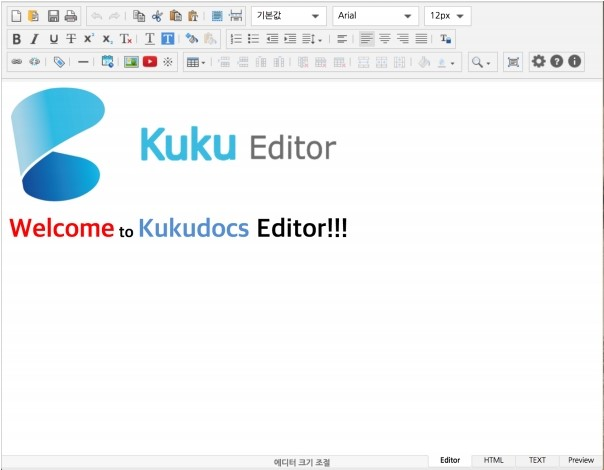
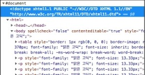

# KukuEditor 개발자 가이드 문서 (v1.4.38)

2019.01.04
<br><br>

## 문서 정보

**문서 개요**

이 문서는 사용자의 웹 사이트에서 "KukudocsEditor"를 사용하는 방법을 설명합니다. 

<br><br>

**독자**

이 문서의 독자는 "KukudocsEditor"를 이용하여 웹 사이트를 운영하고, 웹 에디터를 관리하는 사용자입니다.

<br><br>

**문의처**

이 문서의 내용에 오류가 있거나 내용과 관련된 의문사항이 있으면 담당자에게 문의하십시오. 

<br><br>

**문서 버전 및 이력**

버전 | 일자 | 이력사항
---|---|---
1.1|2017.08.12|개발자 가이드 상세 설정 내용 추가
1.2|2017.09.01|OperationSetting.bundle.js 항목제거, 'auto_save_load' 기능 추가
1.3|2017.09.15|배경이미지, 파일삽입, 이모티콘, 텍스트방향 기능 추가
1.4|2017.09.29|템플릿열기, 레이아웃, 레이어 삽입, 인용구문 기능 추가
1.4.1|2017.11.15|MenuBar 기능 추가 및 IE 안정성 개선 추가
1.4.3|2018.01.08|emoticonPathURL 옵션 정보 추가
1.4.4|2018.01.15|오탈자 수정 및 문서 정리
1.4.5 | 2018.01.22|문서 버전 정리
1.4.6|2018.01.30|Ver 1.4.6 버전 정리
1.4.7|2018.02.02|Ver 1.4.7 버전 정리
1.4.8|2018.02.06|Menu Bar에 누락된 Menu코드 추가.
1.4.9|2018.02.19|Ver 1.4.9 버전 정리
1.4.10|2018.03.09|Ver 1.4.10 버전 정리
1.4.11|2018.03.19|Ver 1.4.11 버전 정리
1.4.12|2018.03.23|Ver 1.4.12 버전 정리
1.4.13|2018.03.29|Ver 1.4.13 버전 정리 및 2.3.1항목의 Key_Event, Mouse_Event 설정 방법 변경 명시, 2.3.5 Menu 사용자 정렬 방법 명시
1.4.14|2018.04.12|Ver 1.4.14 버전 정리 및 Font 설정 옵션, 사용자 메뉴 정렬 옵션 등 추가
1.4.15|2018.04.20|Ver 1.4.15 버전 정리 및 undoRedoLimit, customButtonMenuItem, customMagicLineStyle, defaultTableWidth 옵션 추가 <br> 옵션설정 방법에 대해서는 2.3.13~2.3.15 항목 참조
1.4.16|2018.04.25|Ver 1.4.16 버전 정리 및 cell_lock_name Default값 변경
1.4.17|2018.04.26|Ver 1.4.17 버전 정리
1.4.18|2018.05.04|Ver 1.4.18 버전 정리 및 customAttributes 옵션 제거
1.4.19|2018.05.10|Ver 1.4.19 버전 정리
1.4.20|2018.05.12|Ver 1.4.20 버전 정리
1.4.21|2018.05.21|Ver 1.4.21 버전 정리
1.4.22|2018.06.25|Ver 1.4.22 버전 정리 <br> * root/stylesheets/editor_style.css 추가 (파일 목록 참고) <br> * options 추가 <br> &nbsp;[2.3 Kukudocs Editor Option정보 및 34Page 옵션 참고]
1.4.23|2018.07.02|Ver 1.4.23 버전 정리 <br> * useOnlyTableContentMenu options
1.4.24|2018.07.24|Ver 1.4.24 버전 정리
1.4.25|2018.08.22|Ver 1.4.25 버전 정리
1.4.26|2018.09.12|Ver 1.4.26 버전 정리
1.4.27|2018.09.28|Ver 1.4.27 버전 정리
1.4.28|2018.10.11|Ver 1.4.28 버전 정리
1.4.29|2018.10.26|Ver 1.4.29 버전 정리
1.4.30|2018.11.09|Ver 1.4.30 버전 정리 및 메뉴바 구성 추가 (메뉴바에 셀 가로/세로 사이즈 같게 기능 버튼 추가)
1.4.31|2018.11.13|Ver 1.4.31 버전정리
1.4.32|2018.11.30|Ver 1.4.32 버전 정리 <br><br> 옵션추가 <br> colorPicker / useLockMenu / lockImageURL <br><br> 메뉴 추가 <br> table_lock / cell_lock
1.4.33|2018.12.10|Ver 1.4.33 버전 정리 / 단축키 정보 추가
1.4.34|2018.12.18|Ver 1.4.34 버전 정리 <br><br> 옵션추가 <br>  [Chrome Browser 제약사항 조절 옵션]  <br> usePasteHTML5TypeAdjustForChrome <br><br> ※ Chorme Browser는 `<p>` 태그 하위에 `<table>` 태그 존재시 복사/붙여넣기 등의 동작을 처리할 때 강제로 `<table>` 태그를 나누는 `(Split)` 특이사항 존재. <br><br> 사용상 안정성을 위해서 외부에서 API를 통해 HTML을 최초 삽입하는 동작시 HTML5 DocType에 맞도록 강제로 `<p>` 태그 하위에 존재하는 `<table>` 태그를 밖으로 빼내는 옵션 <br><br> &nbsp; &nbsp; Ex) `<p><table/></p>` ➔ `<p/><table/>`
1.4.35|2018.12.20|Ver 1.4.35 버전정리
1.4.36|2018.12.21|Ver 1.4.36 버전정리 및 대/소문자, 취소선 단축키 추가
1.4.37|2018.12.27|Ver 1.4.37 버전정리
1.4.38|2019.01.04|Ver 1.4.38 버전정리 (2.3.21 항목 참조) <br><br>옵션추가<br>useNoneBorderVisualize

<br><br>

## 표기 규칙

**참고 표기**

>**참고**
독자가 참고해야할 내용을 기술합니다.

<br><br>

**주의 표기**
>**주의**
독자가 반드시 알아야 할 사항, 기능상의 오류를 유발할 수 있는 사항.  

<br><br>

**기능 명/ 입력 값 / 출력 값 표기**  
>* **기능이름**:'기능 명'
>* **입력 값**: *입력 정보*를 나타냅니다. 
>* **출력 값**: *출력 정보*를 나타냅니다. 

<br><br>

**소스 코드 표기**  
이 문서에서 소스코드는 아래와 같은 박스 안에 표기합니다.  
```JS
new KuKudocsEditor('editor', {
    width : '100%',
    height : '100%',
    hiddenMenu : ['save', 'print'],
    fileUploadURL : '/fileUpload',
    Editor_Complete : Editor_Complete
});
```

<br><br>

# 1. KukuDocs Editor 소개  
## 1.1 KukuDocs Editor 란 무엇인가?  
Kukudocs Editor는 ‘Kukudocs’와 ‘Editor’라는 두 단어를 합친 이름으로 (주)Kukudocs에서 제작된 웹 사이트 상에서 사용하는 ‘WYSIYYG 웹 에디터’ 입니다.

Kukudocs Editor는 웹 사이트에서 게시글 작성시 도움을 주는 기능을 하며, 기존의 Editor들 보다 편리하게 편집하기 위한 기능과 높은 확장성을 제공하고 있습니다.

Kukudocs는 확장기능을 제공하고 있으며, jQuery, jQueryUI 등의 라이브러리들의 기능들과 더불어 추가 기능을 조합하여 사용자가 사용 할 수 있습니다.  

<br>

KukuDocs Architecture|
:-:|
|

<br><br>

> 참고  
API에 대한 자세한 정보는 API 문서를 참고하십시오.  

<br><br>

## 1.2 Kukudocs Editor기능 및 특징
Kukudocs Editor의 기능 및 특징은 다음과 같습니다.

<br><br>

**손쉬운 Editor 생성 및 사용**  
KukuDocs Editor는 기존 에디터들에서 사용한 Textarea를 사용하는 방식과 직접 HTML 정보를 산입하는 방식의 두가지 방식을 지원함으로써 기존 환경을 쿠게 변경하지 않고 간편하게 Editor의 생성 및 사용이 가능합니다.

<br><br>

**Editor 단일 구조**  
Kukudocs Editor 는 Editor 만을 위한 단일구조로 작성되어 하나의 패키지를 사용하여 Editor 의 사용이 가능합니다.

<br><br>

**추가 기능에 대한 옵션**  
Kukudocs	Editor	는	기본형	Editor	및	추가기능에	대한	다양한	모듈을 제공합니다. 사용자는 사용하고자 하는 기능에 대해서 적합한 옵션을 선택하여 원하는 기능을 조절 할 수 있습니다.

<br><br>

**API 를 이용한 외부 처리 방식**  
Kukudocs Editor 는 내부의 처리되는 기능 뿐만 아니라, 외부에서 Instance 에서 제공되는 API 를 이용하여 Editor 의 설정을 변경하거나, 별도의 Event 처리가 가능합니다.  

<br><br>

## 1.3 용어정리
Kukudocs Editor에서 사용되는 용어를 정리합니다.  

- **KukuDocs Editor:** KukuDocs Editor 를 구성하는 핵심 Editor 영역으로 Editor 의 정보 및 기능
처리에 대한 Instance 를 의미함.  

- **모듈:** KukudocsEditor 에서 사용되는 기능에 대한 실행 단위.  

- **위젯버튼:** KukudocsEditor 에서 제공되는 메뉴에 대한 기본적인 버튼 단위.  

- **Selection:** 선택된 영역에 대한 반전처리 의미.  

- **Range:**  선택된 영역에 대한 범위정보를 의미.  

- **Context-Menu:** Mouse 오른쪽 버튼을 클릭해서 나타나는 메뉴.  

- **API:** KukudocsEditor 를 생성 후 사용되는 Instance 를 통해 editor 의 정보를 변경하거나 얻기 위해서 외부에서 접근가능하게 사용되는 기능의 포괄적인 요소.  

<br><br>

# 2. Editor 생성 및 사용
이 장에서는 KukudocsEditor의 생성과 사용을 설명합니다.

<br><br>

## 2.1 Kukudocs Editor 생성 전 준비
Kukudocs Editor는 웹 브라우저에서 사용되는 Wysiwyg Editor입니다. Kukudocs Editor를 사용하기 위해서는 Kukudocs Editor를 실행 할 특정 페이지에 포함되어야 하며, jQuery library를 사용하는 기반으로 작성되었기 때문에 필수적으로 jQuery library가 필요합니다.

<br><br>

## 2.1.1 파일 목록
웹 페이지가 구축된 환경에서 ‘Kukudocs Editor’를 사용하기 위한 파일에 대한 목록은 다음과 같습니다. 필수 요소에 대한 파일이 누락되었을 경우 정상 동작 하지 않습니다.

파일 | 환경 | 필수/선택  
---|---|:-:
root/externalLib/jquery-1.9.1.js | ver 1.9.1 이상 | 필수
root/externalLib/jquery-ui-1.11.4.min.js | ver 1.11.4 이상 | 필수
root/images/* | | 필수
root/stylesheets/style.css | | 필수
root/stylesheets/editor_style.css | | 선택사항
root/javascript/build/Editor.bundle.js | | 필수
root/lang/* | | 필수
<br>

>주의  
반드시 필수 사항의 파일들을 사용해야 합니다.

<br><br>

## 2.1.2 파일 목록 상세  
### 1) externalLib  

|
:-:| 

- jquery-1.9.1.min.js  <br><br> : jQuery란 javascript source code로 이루어진 라이브러리로 가장 많이 사용되는 웹 개발 라이브러리 입니다.  <br><br> : KukudocsEditor에서는 1.9.1 버전을 사용합니다.  
<br> Download: https://jquery.com/
<br><br>

- jquery-ui-1.11.4.min.js  <br><br> : jQuery ui 란 javascript와 css를 이용하여 UI를 손쉽게 구현할 수 있도록 제작된 라이브러리 입니다.  <br><br> : KukudocsEditor에서는 1.11.4 버전을 사용합니다.  <br><br> Download : <https://jqueryui.com/>  
<br>

### 2) images  
  
- Kukudocs Editor에서 사용하는 이미지 파일로 구성  
<br>

### 3) javascript  

  
- Editor.bundle.js  <br><br> : KukudocsEditor의 Loader 기능 및 에디터를 사용하기 위해서는 반드시 사용해야하는 Javascript 필수 요소 파일
<br>

### 4) stylesheets

|
:-:|

- style.css  <br><br> : KukudocsEditor UI 구성을 위한 기본적인 CSS 요소들을 정의한 스타일 파일 <br> (기존 웹 페이지에서 사용중인 CSS의 속성들과 충돌할 우려가 있으므로 주의)  
<br><br>

- editor_style.css  <br><br> : Editor 내부에서 편집시 정의하는 기본 Style 정보를 지정하는 CSS 파일로 font-size, color 등과 같이 Editor 내부의 Contents에 대한 스타일을 지정. <br> (Editor 내부적으로만 사용하는 Style요소이므로 외부로 Export 되어 지지 않으므로 주의)
<br>

### 5) lang

|
:-:|

- lang  <br><br> : kukudocs Editor의 다국어 처리를 위한 Resource 파일
<br>

### 6) index.html

|
:-:|

- Kukudocs Editor를 사용 방법을 적용한 html 파일
<br><br>
## 2.1.3 지원 브라우저

  브라우저 | 버전
---|---
   <br> **Internet Explorer**  | Version 10, 11, edge  
   <br> **Google Chrome** | Version 54 or More version
   <br> **Safari** | 3.1 or More version
   <br> **Opera** | 9 or More version
   <br> **Firefox** | 3.5 or More version
<br>

>**참고**  
**Internet Explorer:** 10 or More version  
**Firefox:** 3.5 (Gecko 1.9.1) or More version  
**Opera:** 9 or More version  
**Safari:** 3.1 or More version  
**Chrome:** 54 or More Version  
**Other** (Modern Web browsers)  

<br><br>

## 2.2 Kukudocs Editor 생성 방법  
Kukudocs Editor는 웹 브라우저가 설치된 모든 환경에서 사용 할 수 있습니다. 사용자는 Kukudocs Editor 를 사용하기 전에 웹 서버 및 웹 페이지를 구축해야 합니다.  
<br>
IE10, IE11, Chrome 등의 웹 브라우저를 통하여 Kukudocs Editor를 실행시키며, 사용자는 Kukudocs Editor를 실행시키기 위한 기초적인 실행 방법을 숙지해야 합니다.  
<br>

추가기능에 대한 내용은 ‘Kukudocs Editor 추가 기능’ 및 ‘API문서’ 를 참고하세요.  
<br>
Editor를 사용하기 위하여 아래 순서에 따라 KukudocsEditor Package에 포함된 파일들을 웹 페이지에 추가합니다.  
<br>

### 1) External library Source 사용 정의  

- jquery-1.9.1.min.js / jquery-ui-1.11.4.min.js 파일 사용정의  <br><br> : KukudocsEditor Package의 externalLib 폴더에 포함된 외부 라이브러리 파일들을 사용하기 위해 정의합니다.  

```html
<!DOCTYPE html>
<html>
<head>
    <title>Kukudocs Editor</title>

    <script type="text/javascript"
            src="/externalLib/jquery-1.9.1.min.js"></script>

    <script type="text/javascript"
            src="/externalLib/jquery-ui-1.11.4.min.js"></script>

</head>
<body>
</body>
</html>
```

### 2) Kukudocs Editor Source 사용 정의
- Editor.bundle.js 파일 사용정의   <br><br> : KukudocsEditor Package의 javascripts/build 폴더에 포함된 Kukudocs Editor 필수 파일들을 사용하기 위해 정의합니다.  <br><br> : 반드시 Editor.bundle.js 선언합니다.  

```html
<!DOCTYPE html>
<html>
<head>
    <title>Kukudocs Editor</title>

    <script type="text/javascript"
            src="/externalLib/jquery-1.9.1.min.js"></script>

    <script type="text/javascript"
            src="/externalLib/jquery-ui-1.11.4.min.js"></script>

    <script type="text/javascript"
            src="/javascripts/build/Editor.bundle.js"></script>

</head>
<body>
</body>
</html>
```

<br>

### 3) Style 사용정의
- style.css 파일 사용정의   <br><br> : KukudocsEditor Layout 구성과 UI의 표현을 위해 해당 파일을 사용합니다.  <br><br> : 해당 파일을 사용해야만 정상적인 Editor의 화면 구성을 할 수 있습니다. <br><br> : 추후 Theme별 Style.css 추가 작업을 진행하면 화면 UI를 Theme별로 변경할 수 있습니다.  

```html
<!DOCTYPE html>
<html>
<head>
    <title>Kukudocs Editor</title>

    <script type="text/javascript"
            src="/externalLib/jquery-1.9.1.min.js"></script>

    <script type="text/javascript"
            src="/externalLib/jquery-ui-1.11.4.min.js"></script>

    <script type="text/javascript"
            src="/javascripts/build/Editor.bundle.js"></script>

    <link rel="stylesheet" href="/stylesheets/style.css">

</head>
<body>
</body>
</html>
```

### 4) Kukudocs Editor 생성 및 Option 설정
- KukudocsEditor를 생성하기 위해서는 반드시 ID가 설정된 Element가 필요하며, Editor의 생성시 초기 Content를 설정하는 두가지 방법을 제공합니다.  

#### (a) Textarea 이용  
&nbsp;: 기존 일부 웹 에디터들의 경우 textarea에 Contents를 적용한 후 Editor를 생성하여 textarea의 Contents를 Editor에 자동 삽입시키는 방식을 사용 했습니다.  
<br>
&nbsp;: Kukudocs Editor에서도 textarea를 사용하는 환경과 동일한 기능을 제공합니다.  
<br>

**<HTML에서의 Textarea 이용>**
```html
<!DOCTYPE html>
<html>
<head>
    <title>Kukudocs Editor</title>

    <script type="text/javascript"
            src="/externalLib/jquery-1.9.1.min.js"></script>

    <script type="text/javascript"
            src="/externalLib/jquery-ui-1.11.4.min.js"></script>

    <script type="text/javascript"
            src="/javascripts/build/Editor.bundle.js"></script>

    <link rel="stylesheet" href="/stylesheets/style.css">

    <script type="text/javascript">
       $(document).ready(function(){
        new KuKudocsEditor(/* ID 입력부 */ 'editor', /* Option 입력부 */ {});
       });
    </script>
</head>
<body>
    <textarea id="editor">
        <div><span>Welcome to Kukudocs Editor</span></div>
    </textarea>
</body>
</html>
```

<br><br>

#### (b) initHTML Options를 이용
&nbsp;: Editor를 생성할 때 직접 HTML Text 삽입하는 기능을 합니다.  
<br>
&nbsp;: initHTML Options을 사용하는 경우는 ID를 가진 ‘DIV’ Element 안에 Editor를 생성하게 됩니다.  
<br>
&nbsp;: KukudocsEditor를 생성시 options 입력 항목에 initHTML Options지정과 ‘HTML 문자열’을 입력하여 적용합니다.  
<br>
&nbsp;: Options에 대한 자세한 내용은 ‘Options 설명’ 항목을 참고하세요.  

<br>

**<initHTML Options를 이용>**
```html
<!DOCTYPE html>
<html>
<head>
    <title>Kukudocs Editor</title>

    <script type="text/javascript"
            src="/externalLib/jquery-1.9.1.min.js"></script>

    <script type="text/javascript"
            src="/externalLib/jquery-ui-1.11.4.min.js"></script>

    <script type="text/javascript"
            src="/javascripts/build/Editor.bundle.js"></script>

    <link rel="stylesheet" href="/stylesheets/style.css">

    <script type="text/javascript">
       $(document).ready(function(){
            new KuKudocsEditor(
                /* ID 입력부 */ 'editor',
                /* Option 입력부 */
                {
                    initHTML : '<div><span>Welcome to Kukudocs Editor</span></div>'
                }
            );
        });
    </script>
</head>
<body>

    <div id="editor"></div>

</body>
</html>
```

<br>

생성된 Kukudocs Editor 모습|
:-:|
|


<br>

> **주의** 
<br><br>
KukudocsEditor 를 생성하기 위해 기준이되는 Element 는 ID 를 가져야하며, ID 는 반드시 유일한 값이어야 정상적으로 생성됩니다.

<br><br>

## 2.3 Kukudocs Editor Option 정보
Kukudocs Editor에서는 생성시 입력 Option에 따라 설정을 변경 할 수 있습니다.

Option Name|Type|Default|목적
:-:|:-:|:-:|:-:
minHeight|Number|<p3>0 (무제한)</p3>|Editor Height 최소 크기 설정
maxHeight|Number|0 (무제한)|Editor Height 최대 크기 설정
width|Number or String|‘600px’|Editor의 Width 크기
height|Number or String|‘700px’|Editor의 Height 크기
initHTML|String|‘’|초기에 삽입 HTML String 값
hiddenMenu|Array[String]|[]|사용하지 않을 Menu 설정<br>(Toolbar Menu Code 참고)
helpURL|String|‘/help.html’|도움말 URL 주소 지정
loadingImageURL|String|‘./images/load.gif’|그림 삽입 시 Loading Image
errorImageURL|String|‘./images/error.png’|표현불가 그림 Error Image
playImageURL|String|‘./images/play.png’|동영상 표현 Image
useFooterMenu|Boolean|true|Footer Menu 사용유무 지정
useHtmlMode|Boolean|true|HTML Mode 사용유무 지정
useTextMode|Boolean|true|TEXT Mode 사용유무 지정
usePreviewMode|Boolean|true|Preview Mode 사용유무 지정
useEditorResize|Boolean|true|Editor Resize 사용우무 지정
fileUploadURL|String|‘/fileUplpad’|File Upload 주소 지정
imageUploadURL|String|‘’|Image Upload 주소 지정
videoUploadURL|String|‘’|Video Upload 주소 지정
Editor_Complete|Function|Null|Editor생성완료시 호출할 함수
Key_event|Object|Null|KeyEvent시 호출할 함수<br>(v1.4.13 시 변경 – 2.3.6 항목 참조)
Mouse_event|Object|Null|MouseEvent시 호출할 함수 <br> (v1.4.13 시 변경 – 2.3.6 항목 참조)
cell_lock_name|String|‘’|Cell_Lock을 적용하는 Attribute Name 값을 지정
emoticonList|Array[String]|[]|Emoticon으로 사용할 이미지들의 URL 배열
templateList|Array[Object]|[]|Template로 사용할 HTML의 정보들을 지정
useMenuBar|Boolean|false|MenuBar를 사용할지의 지정 <br> (v1.4.1 추가) (MenuBar Setting 참조)
publicPathURL|String|‘./’|Public 리소스의 위치 주소 <br> (v1.4.10 추가)
customAlignMenu|Array|[]|Menu의 정렬위치 조정 <br> (v1.4.14 추가) 2.3.5 메뉴정렬 참조
fontSize|Array|[]|사용자 지정 폰트크기 목록 설정 <br> (v1.4.14 추가) 2.3.8 Attributes설정 참조
fontFamily|Array|[]|사용자 지정 폰트 목록 설정 <br> (v1.4.14 추가) 2.3.9 Attributes설정 참조
defaultFontSize|String|‘11pt’|사용자 지정 기본 폰트크기 설정 <br> (v1.4.14 추가) 2.3.10 Attributes설정 참조
defaultFontFamily|String|‘맑은 고딕’|사용자 지정 기본 폰트 설정 <br> (v1.4.14 추가) 2.3.11 Attributes설정 참조
languagePathURL|String|‘./lang/|사용자 지정 언어 리소스 Path 설정 <br> (v1.4.14 추가) 2.3.12 Attributes설정 참조
defaultLanguage|String|‘kr|사용자 지정 기본 언어 설정 <br> (v1.4.14 추가) 2.3.12 Attributes설정 참조
useFullURLPath|Boolean|false|이미지 업로드시 Full URL Path <br> 허용 여부 설정 (v1.4.14 추가)
undoRedoLimit|Number|1000|편집시 되돌리기/되살리기 <br> History Stack의 개수 설정(v1.4.15 추가)
customButtonMenuItem|Array|[]|사용자정의 Toolbar 버튼 추가 옵션 <br>(v1.4.15 추가) 2.3.13 사용자 정의 툴바 버튼 설정 방법 참조
customMagicLineStyle|String|‘’|사용자 지정 문단추가 (MagicLine) 스타일 설정 <br>(v1.4.15 추가) 2.3.14 문단추가버튼 스타일 설정 방법 참조
defaultTableWidth|Number|0|표 생성시 가로 크기 설정<br>(v1.4.15 추가) 2.3.14 표생성시 기본가로 사이즈 설정 방법 참조
tableSelectImageURL|String|Root의 상대경로<br>‘images/<br>cross_arrow.png’|표 전체 선택에 사용할 Image 지정 <br>(v1.4.22 추가) 에디터 사용시에 필요하므로 삭제 지양
tableMoveHandlerImageURL|String|Root의 상대경로 <br>‘images/<br>movehandler.png’|표 이동시에 사용할 Image 지정 <br> (v1.4.22 추가) 에디터 사용시에 필요하므로 삭제 지양
tableMoveImageURL|String|Root의 상대경로<br>‘images/<br>drag_table.png’|표 이동시에 사용할 Image 지정 <br>(v1.4.22 추가) 에디터 사용시에 필요하므로 삭제 지양
defaultEditorStylePath|String|Root의 상대경로<br>‘../stylesheets/<br>editor_styls.css’|Editor 내부에서 표현 할 기본 Style요소 정의 파일<br>(v1.4.22 추가)
defaultDocType|Object|Null|Editor에 적용할 HTML DocType 지정 옵션 <br> (v1.4.22 추가) 2.3.15 Editor DocType 지정 옵션 참조
defaultCharset|String|‘utf-8’|Editor에 적용할 HTML Charset 설정 <br> (v1.4.22 추가) 2.3.16 HTML Charset (문자 Encoding) 지정 옵션
useSecurityScript|Boolean|true|Editor에 적용하는 HTML내부의 script 제거(script, vbscript) <br> (v1.4.22 추가) 2.3.17.HTML Security 관련 지정 옵션
useSecurityEvent|Boolean|true|Editor 내부에 존재하는 HTML의 DOM에 지정한 on-event를 제거 <br> (v1.4.22 추가) 2.3.17.HTML Security 관련 지정 옵션 
notRemoveEventTypes|Array|[]|useSecurityEvent의 사용설정시 제거하지 않을 on-event에 대하여 Array형태로 지정하는 useSecurityEvent 옵션에 종속되는 추가 옵션(useSecurityEvent 미 사용시 동작하지 않음) <br> (v1.4.22 추가) 2.3.17.HTML Security 관련 지정 옵션
tabSpaceSize|Number|4|Tab KeyDown시에 Tab 간격크기 조절 옵션 <br> (v1.4.22 추가)
usePasteFilterForChrome|Boolean|true|Chrome Browser 대상으로 하는 옵션으로 Paste시 Filtering 처리 유무 선택 옵션 <br> (v1.4.22 추가) 2.3.18.Chrome Browser 해당 지정 옵션 usePasteConfirmForChrome|Boolean|true|Chrome Browser 대상으로 하는 옵션으로 Clipboard에 HTML과 Image가 동시에 존재할 경우 붙여넣기 선택사항에 대한 옵션 지정하는 usePasteFilterForChrome에 종속되는 옵션 (usePasteFilterForChrome 미사용시 동작하지 않음) <br> (v1.4.22 추가) 2.3.18.Chrome Browser 해당 지정 옵션
useFirstFocus|Boolean|true|Editor Load시 Focus 지정 옵션 <br> (v1.4.22 추가)
useOnlyTableContentMenu|Boolean|true|Table Context Menu에 Table에 관련한 Menu만 나타나도록 설정하는 옵션 <br> (v1.4.23 추가)
useLockMenu|Boolean|false|표와 셀에 잠금 설정하는 기능에 대해 사용여부 설정옵션 <br> ※ ‘cell_lock_name’ 옵션 필수 <br> (v1.4.32 추가)
lockImageURL|String|Root의 상대경로 <br> ‘images/lock.png’|표와 셀에 잠금설정시 표시될 이미지에 대한 URL 설정옵션 <br> ※ ‘useLockMenu’ 옵션 필수 <br> (v1.4.32 추가)
useAdjustForChrome|Boolean|true <br> (p tag안에 table이 존재 시 붙여넣기 동작 문제 발생 보정)|Chrome 보정 처리 옵션 <br>Ex)    `<p><table/></p>` <br> ➔ `<p/><table/>` <br> (v1.4.34 추가)
colorPicker|Object|아래 상세옵션 참조|에디터에서 사용할 컬러값에 대한 설정 옵션 <br> (v1.4.32 추가)
useNoneBorderVisualize|Boolean|false|에디터 편집화면에서 셀 Border Line 없을 경우 시각화 표현옵션 <br> (v1.4.38 추가)

<br><br>

[Color Picker Options 지정값]|
---|
[참고] 2.3.19 사용자 지정 Color Picker 설정 옵션  <br> ※ 컬러에 대해 UI 적용시 라인별 컬러는 10개 단위가 최적화 표현입니다. <br> ※ 컬러값 설정시 Hex 값으로 입력 / Hex값 앞 #기호 생략 (예 : ‘#000000’ => ‘000000’)<br>|

<br><br>

**[컬러값 Default 설정 정보]**  
```
colorPicker : {
simpleColor : ["ffffff", "000000", "eeece1", "1f497d", "4f81bd", "c0504d", "9bbb59", "8064a2", "4bacc6", "f79646"],
standardColor : ["f2f2f2", "808080", "ddd9c3", "c6d9f1", "dce6f2", "f2dcdb", "ebf1de", "e6e0ec", "dbeee0", "fdeada",
             "d9d9d9", "595959", "c4bd97", "8eb4e3", "b9cde5", "e6b9b8", "d7e4bd", "ccc1da", "b7dee8", "fcd5b5",
             "bfbfbf", "404040", "948a54", "558ed5", "95b3d7", "d99694", "c3d69b", "b3a2c7", "93cddd", "fac090",
             "a6a6a6", "262626", "4a452a", "17375e", "376092", "953735", "77933c", "604a7b", "31859c", "e46c0a",
             "808080", "0d0d0d", "1e1c11", "10243f", "254061", "632523", "4f6228", "403152", "215968", "984807"],
normalColor: ["c00000", "ff0000", "ffc000", "ffff00", "92d050", "00b050", "00b0f0", "0000ff", "002060", "7030a0"]
}
```
<br><br>

> **참고**  <br><br>
helpURL, loadingImageURL, errorImageURL, fileUploadURL, imageUploadURL,
videoUploadURL, videoUploadURL, lockImageURL 과 같은 URL Option 들의
경우에는 사용자가 Editor를 생성하는 Web 주소를 기준으로 URL을 판단하게
되므로 별도의 주소정보를 입력해 주어야 합니다.  <br><br> (기본으로 사용되는 상대경로는 Editor를 사용하는 주소를 Root로 판단합니다.)  


<br><br>

일부 Menu가 Hidden된 Kukudocs Editor 모습|
:-:|
|

<br><br>

## 2.3.1 Option 추가 방법
Option은 Editor 생성시 추가할 수 있으며, Editor 생성 후 Options 항목에 대한 변경 방법은 API 소개 문서에서 확인 할 수 있습니다.  
<br>

**<Kukudocs Editor 생성시 Options를 이용 예>**
```JS
function Editor_Complete() { console.log("Editor Load Complete !!!"); }
function Key_down_event(e) { console.log("Key_Down_event Call !!!"); }
function Key_up_event(e) { console.log("Key_Up_event Call !!!"); }
function Mouse_Down_event(e) { console.log("Mouse_Down_event Call !!!"); }
function Mouse_Up_event(e) {console.log("Mouse_Up_event Call !!!");}

$(document).ready(function(){
    new KuKudocsEditor(
        /* ID 입력부 */
        'editor',

        /* Option 입력부 */
        {
             //에디터 최소 높이설정
             minHeight : 0,
             maxHeight : 0,

            //Editor 설정시 초기 HTML 설정
             initHTML : '',

            //Editor 가로크기
             width : '600px',

             //Editor 세로크기
             height : '700px',

             //Hidden Menu 설정
             hiddenMenu : ['fileGroup', 'undo', 'redo'], /* Menu Option Hidden list */

             //도움말 URL 설정
             helpURL : '/help.html',

             //Editor Public Resource URL
             publicPathURL : './',

             //Loading Image Resource URL
             loadingImageURL : 'images/load.gif',

             //Error Image Resource URL
             errorImageURL : 'images/error.png',

             //Video Image Resource URL
             playImageURL : 'images/play.png',

             //Emoticon Images Root URL
             emoticonPathURL : 'images/emoticon/',

             //Emoticon URL List
             emoticonList : ['emoticonURL1', 'emoticonURL2'] /* emoticon url list */,

             //HTML Mode 사용유무
             useHtmlMode : true,

             //Text Mode 사용유무
             useTextMode : true,

             //Preview Mode 사용유무
             usePreviewMode : true,

             //Editor Resize 기능 사용유무
             useEditorResize : true,

             //MenuBar 사용유무
             useMenuBar : false,

             //Footer Menu 사용유무
             useFooterMenu : true,

             //File Upload Action URL
             fileUploadURL : '/fileUpload',

             //Image Upload Action URL
             imageUploadURL : '', // '/fileUpload'

             //Video Upload Action URL
             videoUploadURL : '', // '/fileUpload'

             //Editor Load 완료시 호출 Callback Function
             Editor_Complete : null,

             //Event 발생시 Callback Function
             Key_event : { keydown : Key_down_event, keyup : Key_up_event },
             Mouse_event: { mousedown : Mouse_Down_event, mouseup : Mouse_Up_event },

             //Kaoni Cell Lock Attibute 설정
             cell_lock_name : 'free',

             //Template 양식 Items
             templateList : [ {
                 name : '부서양식',
                 items : [ { name : '회의록', type : 'url', value : '/template/meeting_log.html' } ]
             }],

             //Toolbar Menu 정렬
             customAlignMenu : [ ['headingGroup', 'fontFamilyGroup'], 'fontSizeGroup'],

             //사용할 Font Size 설정
             fontSize : [ {name: "8pt", value: "8pt"}, {name: "9pt", 	value: "9pt"}],
 
             //사용할 Font Family 설정
             fontFamily : [ {name: "굴림", value: "굴림"}, {name: "돋움", value: "돋움"}],

             //기본 Font Size
             defaultFontSize : '11pt',

             //기본 Font Family 설정
             defaultFontFamily : '맑은 고딕',

             //Image Uoload시 Full URL Path 설정
             useFullURLPath : false,

             //Language Resource 위치 URL
             languagePathURL : './lang/',

             //사용할 Language 설정
             defaultLanguage : 'kr',

             //되돌리기 / 되살리기 History Stack Limit 설정
             undoRedoLimit : 1000,

             //Custom Button Menu 아이템 설정
             customButtonMenuItem : [
                 {
                     id : "customButton1",
                     name : "customButton1",
                     style : "background:url('./images/drag_table.png'); background-size:20px 18px;",
                     action : function(){ alert('Custom Menu1111!!'); }
                 }
             ],

             //표 위아래 문단 추가 버튼의 스타일 지정
             customMagicLineStyle : 'background-color:#0000ff;',

             //표 생성시 기본 가로 사이즈 지정
             defaultTableWidth : 500,

             //New Options
             //표 전체 선택을 위한 이미지 URL 지정
             tableSelectImageURL : 'images/cross_arrow.png',

             //표 이동시 사용할 이미지 URL 지정
             tableMoveHandlerImageURL : 'images/movehandler.png',

             //표 드래그시 사용할 이미지 URL 지정
             tableMoveImageURL : 'images/drag_table.png',

             //Editor 내부에서 사용할 Style 지정 CSS 파일
             defaultEditorStylePath : '../stylesheets/editor_style.css',

             //xhtml1.1 Doc Type 지정 예
             defaultDocType : {
             docType : 'xhtml1.1',
             publicId : '-//W3C//DTD XHTML 1.1//EN',
             systemId : 'http://www.w3c.org/TR/xhtml11/DTD/xhtml11.dtd'
             },

             //Default Character Set 지정 예
             defaultCharset : 'utf-8',

             //Script Tag 제거 (script, vbscript)
             useSecurityScript : true,

             //DOM의 on-Event 제거 (false시 on-event들을 제거안함)
             useSecurityEvent : true,

             //제거하지 않을 Event의 Type들 지정 예)
             notRemoveEventTypes : ['onclick','mousedown'],

             //Tab Size 지정
             tabSpaceSize : 4,

             //Chrome Filter Paste Options
             usePasteFilterForChrome : true,

             //HTML & Image Confirm Option
             usePasteConfirmForChrome : true,

             //Editor Load시 Focus 지정 옵션
             useFirstFocus : true,

             //Table에 관한 ContextMenu시 Table관련 Menu만 보여지도록 설정
             useOnlyTableContentMenu : true,

             //Toolbar에 Table/Cell Lock 기능 사용 설정 [cell_lock_name 옵션 설정 필수]
             useLockMenu : false,

             //Table / Cell Lock Image URL 설정
             lockImageURL : 'images/lock.png',

             //Color Picker 값 수정
             colorPicker : {
 

 
                 simpleColor: ["ffffff", "000000", "eeece1", "1f497d", "4f81bd", "c0504d", "9bbb59", "8064a2", "4bacc6", "f79646"],
                 standardColor: ["f2f2f2", "808080", "ddd9c3", "c6d9f1", "dce6f2", "f2dcdb", "ebf1de", "e6e0ec", "dbeee0", "fdeada", "d9d9d9", "595959", "c4bd97", "8eb4e3", "b9cde5", "e6b9b8", "d7e4bd", "ccc1da", "b7dee8", "fcd5b5", "bfbfbf", "404040", "948a54", "558ed5", "95b3d7", "d99694", "c3d69b", "b3a2c7", "93cddd", "fac090", "a6a6a6", "262626", "4a452a", "17375e", "376092", "953735", "77933c", "604a7b", "31859c", "e46c0a", "808080", "0d0d0d", "1e1c11", "10243f", "254061", "632523", "4f6228", "403152", "215968", "984807"],
                 normalColor: ["c00000", "ff0000", "ffc000", "ffff00", "92d050", "00b050", "00b0f0", "0000ff", "002060", "7030a0"]
             },

             //Chrome 전용 / <p>태그 하위에 <table>존재 하지 못하도록 하는 HTML5 표준설정 옵션
             useAdjustForChrome : true,

             //Cell에 Border가 None이거나 굵기가 0일경우 Editor 편집화면에서 점선으로 표시하는 시각화 표현 옵션
             useNoneBorderVisualize : false
```
<br><br>

## 2.3.2 Toolbar Menu Code
: Hidden 시킬 수 있는 Menu의 Code 목록 입니다.  
<br>
: hiddenMenu Options에 아래 Group명 또는 Menu Code 를 입력하면 해당 Menu 기능을 사용할 수 없도록 지정할 수 있습니다.  
<br>

**Group 명: ‘fileGroup’**

code|기능
---|---
‘new’|새로만들기
‘file_open’|파일 열기
'save'|저장
'print'|인쇄
‘auto_save_load’|자동 저장 불러오기 (v1.2 추가)
‘layout’|레이아웃 (v1.4 추가)
‘template’|템플릿 (v1.4 추가)<br>(Template Setting 참조)
<br>

**Group 명: ‘editGroup’**

code|기능
---|---
'undo'|되돌리기
'redo'|되살리기
'copy'|복사
‘cut’|잘라내기
‘paste’|붙여넣기
'text_paste'|텍스트로 붙여넣기
'all_select'|전체선택
'page_break'|페이지 분할
<br>

**Group 명: ‘headingGroup’**

code|기능
---|---
'heading'|기본서식
<br>


**Group 명: ‘fontFamilyGroup’**

code|기능
---|---
'fontFamily'|글꼴
<br>

**Group 명: ‘fontSizeGroup’**

code|기능
---|---
'fontSize'|글자크기
<br>

**Group 명: ‘textFormatGroup’**

code|기능
---|---
'bold'|굵게
'italic'|기울임
'underline'|밑줄
'strikeThrough'|취소선
'superscript'|위첨자
'subscript'|아래첨자
'remove_format’|글자서식 제거
'color'|글자색
'backgroundColor'|바탕색
'textFormatCopy'|글자서식 복사
'textFormatPaste'|글자서식 붙여넣기
‘cell_horizontal_size’|셀 가로크기(너비) 같게
‘cell_vertical_size’|셀 세로크기(높이) 같게
<br>

**Group 명: ‘paragraphFormatGroup’**

code|기능
---|---
'numbered_list'|글머리 번호
'bullet_list'|글머리 기호
'outdent'|내어쓰기
'indent'|들여쓰기
'line_height'|줄간격
'paragraph_margin'|문단 여백
'align_left'|왼쪽 정렬
'align_center'|가운데 정렬
'align_right'|오른쪽 정렬
'align_justify'|양쪽 정렬
'paragraph_remove_format'|문단 서식 제거
‘dir_ltr’|글쓰기방향 좌->우로(v1.3 추가)
‘dir_rtl’|글쓰기방향 우->좌로(v1.3 추가)
<br>

**Group 명: ‘insertGroup’**

code|기능
---|---
'link'|하이퍼링크
'unlink'|하이퍼링크 제거
'bookmark'|책갈피 삽입
'horizontal'|수평선 삽입
'date_format'|날짜/시간 삽입
‘background_image’|배경이미지 설정 (v1.3 추가)
'image'|이미지
'video'|동영상 삽입
‘file’|파일 삽입(v1.3 추가)
'symbol'|특수문자
‘emoticon’|이모티콘 삽입(v1.3 추가)
‘upper_lower’|대/소문자 변환(v1.3 추가)
‘blockquote’|인용구문 (v1.4 추가)
‘layer’|레이어 삽입 (v1.4 추가)
<br>

**Group 명: ‘tableGroup’**

code|기능
---|---
'table'|표 생성
'table_insert_left'|왼쪽 열 삽입
'table_insert_right'|오른쪽 열 삽입
'table_insert_top'|상단 행 삽입
'table_insert_bottom'|하단 행 삽입
'table_remove_col'|열 삭제
'table_remove_row'|행 삭제
'table_remove_table'|테이블 삭제
'table_merge'|병합
'table_split_col'|열 분할
'table_split_row'|행 분할
'table_background_color'|표 바탕색
'table_border_style'|선 스타일
‘cell_horizontal_size’|셀 가로 크기 동일 맞춤<br>(v1.4.31 추가)
‘cell_vertical_size’|셀 세로 크기 동일 맞춤<br>(v1.4.31 추가)
‘table_lock’|테이블 잠금 설정<br>(v1.4.32 추가)
‘cell_lock’|셀 잠금 설정<br>(v1.4.32 추가)
<br>

**Group 명: ‘toolGroup’**

code|기능
---|---
'find_replace'|찾기/바꾸기
<br>

**Group 명: ‘viewGroup’**

code|기능
---|---
'fullscreen'|전체화면
<br>

**Group 명: ‘helpGroup’**

code|기능
---|---
‘setting’|환경설정
'help'|도움말
'about'|버전정보
<br>

**Group 명: 기타 메뉴구분자**

code|기능
---|---
‘menu_line’|Custom Menu 정렬시 메뉴 구분

<br><br>


## 2.3.3 MenuBar Group Settings
: MenuBar 사용시 메뉴바에 표현될 그룹에 대한 사을 설정 시킬 수 있는 MenuBar의 Code 목록 입니다.  
<br>
: hiddenMenu Options과 동일하게 또는 Menu Code 또는 MenuBar Group코드를 입력하면 해당 Menu기능을 사용할 수 없도록 지정할 수 있습니다.  
<br>

MenuBar 명|기능
---|---
‘menuFile|파일 메뉴바 사용설정
‘menuEdit’|편집 메뉴바 사용설정
'menuView'|보기 메뉴바 사용설정
'menuInsert'|삽입 메뉴바 사용설정
‘menuStyle’|서식 메뉴바 사용설정
‘menuTable’|표 메뉴바 사용설정
‘menuTool’|도구 메뉴바 사용설정
‘menuHelp’|도움말 메뉴바 사용설정
<br>

## 2.3.4 Template Setting
: Editor내에서 사용할 Template를 설정하기 위한 기본 구조를 나타냅니다.  

: Template는 사용자가 원하는 Template으로 설정할 수 있도록 Editor를 초기에 생성시 설정할 수 있습니다.  

: template item의 type(url 또는 html)에 따라서 url 주소 및 html string으로 설정할 수 있습니다.  
<br>

**<Template List 기본구조>**
```JS
{
     // template category 이름
 
     name : ‘Template Category Name’, //ex) 부서양식
     items : [
       {
             name : ‘template name’, //ex) 회의록
             type : ‘url or html’,   //ex) url
             value : ‘url address or html’ //ex) http://www.sample.com/sample.html
       },
       ……
     ],
     ……
}
```
<br><br>

## 2.3.5 Menu 기능 사용자 정의 Custom-Align
: Editor 상단 메뉴의 위치를 변경할 수 있는 추가 기능입니다.  
<br>
&nbsp; (2.3.2항목의 Toolbar Menu Code 참조)  
<br>

**<Menu Align 을 위한 기본 구조>**
```JS
new KuKudocsEditor('editor', {
         /* Guide 문서 2.3.1 항목 참조 */
         customAlignMenu : [ 'bold', 'italic','underline', ..... 	]
});
```  
<br>

#### *1) Group 의 위치만을 변경할 경우*
```JS
customAlignMenu : ['fileGroup', 'editorGroup', 'headingGroup', 'fontFamilyGroup',
                  'fontSizeGroup', 'textFormatGroup', 'paragraphFormatGroup', 
                  'insertGroup', 'tableGroup', 'toolGroup', 'viewGroup', 'helpGroup'],
```  
<br>

#### *2) 개별 메뉴의 위치만을 변경할 경우*
```JS
customAlignMenu : ['bold', 'italic', 'underline', 'strike_through', 'super', 'sub', 'remove_format',
                 'menu_line', 'color', 'background_color', 'menu_line', 'textFormatCopy',
                 'textFormatPaste'],
```

<br>

#### *3) 그룹 + 메뉴의 위치를 변경할 경우*
```JS
customAlignMenu : ['fileGroup', 'editorGroup', 'headingGroup', 'fontFamilyGroup',
                 'fontSizeGroup', 'bold', 'italic', 'underline', 'strike_through', 'super', 'sub',
                 'remove_format', 'menu_line', 'color', 'background_color', 'menu_line',
                 'textFormatCopy', 'textFormatPaste', 'paragraphFormatGroup',
                 'insertGroup', 'tableGroup', 'toolGroup', 'viewGroup', 'helpGroup'],
```
<br>

#### *4) 라인별로 메뉴의 위치를 조절할 경우 (2차원 배열로 그룹처리)*
```JS
customAlignMenu : [['fileGroup', 'editorGroup', 'headingGroup'], ['fontFamilyGroup',
                 'fontSizeGroup'], ['bold', 'italic', 'underline'], 'color', 'background_color',
                 'menu_line', 'textFormatCopy', 'textFormatPaste' ]
```
<br><br>

## 2.3.6 Event Callback Funtions 설정
: Editor내 이벤트 발생시 사용자가 해당 이벤트에 대해 Callback Functions를 설정할 수 있습니다.  
<br>

**<Event Callback Functions를 설정하기 위한 기본 구조>**
```JS
Key_event : {  
     ‘EventName’ : Callback_functions  
},  
Mouse_event : {  
     ‘EventName’ : Callback_functions  
}  
```
```JS
new KuKudocsEditor('editor', {
     Key_event   :{
         'keydown' : Key_down_event,
         'keyup' : Key_up_event
     },
     Mouse_event : {
         'mousedown' : Mouse_Down_event,
         'mouseup' : Mouse_Up_event
     }
});
```
<br><br>
## 2.3.7 Menu 단축키 정보

**Menu Group: 되돌리기/되살리기**

Name|Hot-Key
:-:|:-:
되돌리기 (Undo)|Ctrl + z
되살리기 (Redo)|Ctrl + y
<br>

**Menu Group: 서식(Format)**

Name|Hot-Key
:-:|:-:
굵게 (Bold)|Ctrl + b
기울임 (Italic)|Ctrl + i
밑줄 (Under-line)|Ctrl + u
취소선 (Strike-Through)|Ctrl + d
대문자변경 (Upper-case)|Ctrl + g
소문자변경 (Lower-case)|Ctrl + h
<br>

**Menu Group: 정렬(Align)**

Name|Hot-Key
:-:|:-:
왼쪽 정렬 (Left)|Ctrl + l
오른쪽 정렬 (Right)|Ctrl + r
가운데 정렬 (Center)|Ctrl + e
양쪽 정렬 (Justify)|Ctrl + j
<br>

**Menu Group: 클립보드**

Name|Hot-Key
:-:|:-:
복사 (Copy)|Ctrl + c
붙여넣기 (Paste)|Ctrl + v
잘라내기 (Cut)|Ctrl + x
<br>

**Menu Group: 기타**

Name|Hot-Key
:-:|:-:
새로만들기 (New)|Ctrl + n
인쇄 (Print)|Ctrl + p
저장 (Save)|Ctrl + s
<br>

## 2.3.8 사용자 지정 Font-Size 설정
: Editor내에서는 사용할 Font Size에 대하여 사용자가 정의하여 설정할 수 있습니다.  

**<Font-Size를 설정하기 위한 기본 구조>**
```
fontSize : [
     {
     ‘name: ‘FontSizeName’,
     ‘value: ‘FontSizeValue’
     },
     …
]
```
```JS
new KuKudocsEditor('editor', {
     fontSize : [
         {name: "8pt",	value: "8pt"},
         {name: "9pt",	value: "9pt"},
         {name: "10pt", value: "10pt"},
         {name: "11pt", value: "11pt"},
         {name: "12pt", value: "12pt"},
         {name: "13pt", value: "13pt"},
         {name: "14pt", value: "14pt"},
         {name: "16pt", value: "16pt"},
         {name: "18pt", value: "18pt"},
         {name: "20pt", value: "20pt"},
         {name: "22pt", value: "22pt"},
         {name: "24pt", value: "24pt"},
         {name: "26pt", value: "26pt"},
         {name: "36pt", value: "36pt"},
         {name: "54pt", value: "54pt"},
         {name: "72pt", value: "72pt"}
     ]
});
```
<br><br>
## 2.3.9 사용자 지정 Font-Family 설정
: Editor내에서는 사용할 Font에 대하여 사용자가 정의하여 설정할 수 있습니다.
```
fontFamily : [
     {
     ‘name: ‘FontSizeName’,
     ‘value: ‘FontSizeValue’
     },
     …
]
```
```JS
new KuKudocsEditor('editor', {
     fontFamily : [
         {name: "나눔고딕", value: "나눔고딕, NanumGothic"},
         {name: "굴림", value: "굴림"},
         {name: "돋움", value: "돋움"},
         {name: "바탕", value: "바탕"},
         {name: "궁서", value: "궁서"},
         {name: "맑은 고딕", value: "맑은 고딕"}
     ]
});
```
<br><br>
## 2.3.10 사용자 지정 기본 Font-Size 설정
: Editor내에서는 사용할 기본 Font-Size에 대하여 사용자가 정의하여 설정할 수 있습니다.

<br>

**<기본 Font-Size를 설정하기 위한 기본 구조>**
```
defaultFontSize: ‘11pt’
```
```JS
new KuKudocsEditor('editor', {
    defaultFontSize : '11pt'
});
```
<br><br>

## 2.3.11 사용자 지정 기본 Font-Family 설정
: Editor내에서는 사용할 기본 Font에 대하여 사용자가 정의하여 설정할 수 있습니다.  
<br>

**<기본 Font를 설정하기 위한 기본 구조>**
```
defaultFontFamily: ‘맑은 고딕’
```
```JS
new KuKudocsEditor('editor', {
     defaultFontFamily : '맑은 고딕'
});
```
<br><br>

## 2.3.12 사용자 지정 기본 언어 설정
: Editor내에서는 사용할 기본 언어에 대하여 사용자가 정의하여 설정할 수 있다.

: URL Parameter`(domain/?lang=kr)` 형식으로 언어 리소스를 참조할 수 있으며, 설정하지 않을시에는 Browser 언어 설정에 따라 언어가 자동 설정되며 브라우저 언어에 해당하는 리소스가 없을시에는 기본으로 설정된 Language에 대해 설정되어 집니다.  

**<기본 언어를 설정하기 위한 기본 구조>**
```
languagePathURL: ‘./lang/’,
defaultLanguage: ‘kr’
```
```JS
new KuKudocsEditor('editor', {
     languagePathURL : './lang/', //언어 리소스의 위치
     defaultLanguage : 'kr'       //기본 언어 설정
});

```
<br><br>

: Editor의 Package내에 존재하는 언어 Resource에 대하여 사용자가 추가하여 설정할 수 있습니다.  
<br>

|
:-:|

<br>
: URL Parameter 설정으로 언어설정이 가능합니다.  

<br><br>

domain/?lang=kr|사용 예)    
---|---

<br><br>

## 2.3.13 사용자 지정 Toolbar Menu 생성 옵션
: Editor 내에서 제공되는 기본 Toolbar Button외에 사용자 정의로 사용할 Button을 추가할 수 있습니다.  
<br>

**<사용자 정의 Toolbar Button 추가를 위한 기본 구조>**
```
customButtonMenuItem : [
    {
         id : “",           //Menu에서 사용할 ID
         name : "",         //Menu 이름(Title Tooltip에 표현)
         style : "",        //Menu에 사용할 CSS 스타일
         action : function  //Menu Click시 처리할 CallBack Function
    }
```
```JS
new KuKudocsEditor('editor',{
    customButtonMenuItem : [
        {
            id : "customButton1",
            name : "customButton1",
            style : "background:url('./images/drag_table.png'); background-size:20px 18px;",
            action : function(){ alert('Custom Menu1 !!'); }
        },
        {
            id : "customButton2",
            name : "customButton2",
            style : "background:url('./images/drag_table.png'); background-size:20px 18px;",
            action : function(){ alert('Custom Menu2 !!'); }
        }
    ]
});
```
<br><br>

## 2.3.14 문단 추가 버튼(MagicLine) 스타일 설정 옵션
: 문단 추가 버튼은 Editor 내에서 표 사용시 표의 위 또는 아래에 문단이 없을 경우 사용자가 글자를 입력할 수 없을 경우가 발생됨에 따라 표의 위 또는 아래에 문단을 추가하는 기능입니다.  
<br>
: 기본 컬러는 눈에 잘 띄도록 붉은색의 버튼이며, 해당 버튼의 스타일을 사용자가 지정 할 수 있습니다.  
<br>

**<문단 추가 버튼 스타일 설정 구조>**
```
customMagicLineStyle : 'background-color:#0000ff;'      //CSS 스타일과 동일
```
```JS
new KuKudocsEditor('editor',{
    customMagicLineStyle : 'background-color:#0000ff;'
});
```
<br><br>

기본 스타일 (빨강)|사용자 변경 스타일
:-:|:-:
|  

<br><br>

## 2.3.15 표 생성시 기본가로 사이즈 설정
: 표 생성시 가로사이즈를 입력하지 않는경우 사용자가 임의로 설정한 가로크기 만큼 생성되도록 설정하는 기능입니다. 설정값을 0으로 처리 할 경우 화면크기 만큼 자동으로 생성 됩니다.

**<표 생성시 기본 가로사이즈 설정 방법>**
```
defaultTableWidth : 500         // 0으로 설정시에는 에디터 화면크기로 생성
```
```JS
new KuKudocsEditor('editor',{
    defaultTableWidth : 500
});
```
<br><br>

## 2.3.16 Editor DocType 지정 옵션
: Editor내에서 표현하는 HTML에 대한 문서형식(DocType)을 지정할 수 있습니다.  

**<DocType 설정 방법>**

[Doctype 참고 문헌]  
https://ko.wikipedia.org/wiki/ 문서 _형식 _선언

//DocType 지정 예

```
defaultDocType : {
    docType : 'xhtml1.1',                                        // doctype 지정
    publicId : '-//W3C//DTD XHTML 1.1//EN',                      // Publish Id 지정
    systemId : 'http://www.w3c.org/TR/xhtml11/DTD/xhtml11.dtd'   // System Id 지정
}
```
※ Default (null) 시에는 DocType을 지정하지 않습니다.
```JS
new KuKudocsEditor('editor',{
    //xhtml1.1 Doc Type 지정 예
    defaultDocType : {
        docType : 'xhtml1.1',
        publicId : '-//W3C//DTD XHTML 1.1//EN',
        systemId : 'http://www.w3c.org/TR/xhtml11/DTD/xhtml11.dtd'
    }
});
```
<br>

DocType 지정 결과|
:-:|
|


<br><br>

## 2.3.17 HTML Charset (문자 Encoding) 지정 옵션
: Editor내에서 표현하는 HTML의 Charset을 지정할 수 있습니다.  

**<Charset 설정 방법>**
//Charset 지정 예
```
defaultCharset : 'utf-8’    // 에디터에 utf-8 형식의 Character Encoding 설정
```
```JS
new KuKudocsEditor('editor',{

    //Default Character Set 지정
    defaultCharset : 'utf-8',

});
```  
<br><br>

charset 지정 결과|
:-:|
|


<br><br>

## 2.3.18 HTML Security 관련 지정 옵션
: Editor내에서 존재하는 Script 요소 및 DOM의 onEvent에 관하여 제거할 수 있습니다.  
<br>

**<Securiy 설정 방법>**  
//Script 제거
```
useSecurityScript : true,                         //script, vbscript 요소 제거
```
//DOM의 on-Event 제거
```
useSecurityEvent : true,                          //on-Event Attribute 제거
```
//제거하지 않을 Event의 Type들 지정
```
notRemoveEventTypes : ['onclick','mousedown']    // 예외 on-Event Attribute 지정
```
```JS
new KuKudocsEditor('editor',{

    //Script 제거
    useSecurityScript : true,

    //DOM의 on-Event 제거
    useSecurityEvent : true,

    //제거하지 않을 Event의 Type들 지정
    notRemoveEventTypes : ['onclick','mousedown']

});
```
<br><br>
## 2.3.19 Chrome Browser 해당 지정 옵션
: Chrome Browser에서만 동작하는 옵션으로 Chrome의 경우 Contents를 붙여넣기시에 Filtering을 처리여부에 대한 지정 옵션입니다.  

**<Securiy 설정 방법>**

//Chrome Filter Paste Options
```
usePasteFilterForChrome : true,         //Filtering 처리 여부 지정
```
//HTML & Image Confirm Option
```
usePasteConfirmForChrome : true         //Chrome HTML & Image Confirm 여부 지정
                                         (usePasteFilterForChrome에 종속되는 옵션입니다.)
```
```JS
new KuKudocsEditor('editor',{

    //Chrome Filter Paste Options
    usePasteFilterForChrome : true,

    //HTML & Image Confirm Option
    usePasteConfirmForChrome : true

});
```
<br><br>

**<usePasteFilterForChrome 지정 결과 비교>**  

원본|
:-:|
|

usePasteFilterForChrome 지정|usePasteFilterForChrome 미지정
:-:|:-:
|   

<br><br>

**<usePasteConfirmForChrome 지정 결과>**  

Confirm Message|
:-:|
|

HTML|Image
:-:|:-:
|  

<br><br>

## 2.3.20 사용자 지정 Color Picker 설정 옵션
: Editor 내에서 제공되는 기본 컬러설정 외에 사용자 정의로 사용할 컬러값을 변경할 수 있습니다.  

**<사용자 정의 컬러 설정을 위한 기본 구조>**  
※ 컬러표현시 한줄에 10개씩 표시가 가능하므로 최적의 UI구성시에는 10의 배수로 컬러 추가를 권장합니다.
```
colorPicker : {
    simpleColor : [ “ffffff”, “000000”, “eeece1” … ],
    standardColor : [ “f2f2f2”, “808080”, “ddd9c3” … ],
    normalColor : [“c00000”, “ff0000”, “ffc000” … ]
}
```
```JS
new KuKudocsEditor('editor',{
    colorPicker : {
        simpleColor :	["ffffff", "000000", ...],
        standardColor : ["f2f2f2", "808080", ...], 
        normalColor :   ["c00000", "ff0000", ...]
    }
});
```
<br><br>
## 2.3.21 편집화면에서의 셀 None Border 시각화 설정 옵션
: Editor Mode로 편집시 셀에 지정된 Border가 None이거나 굵기가 0일 때 화면에 셀이 사라져 보여 사용시 어려움이 있을 때 편집을 원활하게 하기 위한 옵션으로 Border가 None이거나 굵기가 0인 셀에 대해 점선으로 표시하도록 변경할 수 있습니다.  
<br>

**<Border Visualize 설정 방법>**  
//Cell None Border Visualize
```
useNoneBorderVisualize : true,              //Default : false
```
```JS
new KuKudocsEditor('editor',{
    // Cell None Border Visualize
    useNoneBorderVisualize : true,
});
```  

적용전(false)|적용후(true)
:-:|:-:
|   

<br><br>

## 2.4 Kukudocs Upload Server Module 설정
Kukudocs Editor의 기능 목록 중 이미지 업로드, 동영상 업로드 등의 파일관련 기능들이 존재하므로, 해당 기능들은 Kukudocs Editor에서 서버에 파일을 업로드하는 동작시 처리 해주어야 합니다.  

따라서 Kukudocs에서는 사용자의 서버구성에 맞추어 적용할 수 있도록 ‘ASP.NET’, ‘JSP’, ‘NodeJS’의 3가지 서버 제품에서 Upload를 처리하는 예제 소스파일을 제공합니다.  

사용자는 해당 제공되는 소스코드에 맞춰서 서버 구성시 업로드 처리 과정을 적용하고, Kukudocs Editor를 생성시 fileUploadUrl, imageUploadUrl, videoUploadUrl 등의 업로드 처리 서버 주소를 설정해 주시기 바랍니다.  
<br><br>

## 2.4.1. Upload를 위한 필수 변수 설정 내용 (공통)
- Upload Module을 사용하기 위한 각 Server Upload Module에서 사용자가 지정해 주어야 하는 필수 변수 설정 내용입니다.  

### 1) UPLOAD_FOLDER_PATH  
: 각 시스템에 맞는 경로지정 방법으로 Upload될 폴더의 <u>절대경로</u>를 지정합니다.  

: ex) “C:\\Upload” (Window) , /home/upload (Linux)  

### 2) URL_PATH
: Upload폴더에 대한 웹 URL 주소를 지정합니다.  

: ex) “http://www.kukudocs.com/upload”  

### 3) Form Data Type Name

- Upload의 경우 File의 형태에 따라 Kukudocs Editor에서는 Type Name을 구별합니다.  

- 사용자가 각 타입별로 별도의 분기 처리를 위하는 등의 Customize 를 처리하는데 사용됩니다.  

#### A) 이미지 파일 타입  
: UPLOAD_IMAGE_TYPE = "image_type";  

#### B) 이미지 Base64 String 타입  
: UPLOAD_IMAGE_BASE64_TYPE = "image_base64_type";  

#### C) 동영상 타입
: UPLOAD_VIDEO_TYPE = "video_type";   

#### D) 일반 파일 타입
: UPLOAD_FILE_TYPE = "file_type";  

#### E) 플래시 파일 타입  
: UPLOAD_FLASH_TYPE = "flash_type";  

<br><br>

## 2.4.2 ASP.NET Upload Server Module 설정

|
:-:|

- ImageUpload.ashx / ImageUpload.ashx.cs <br><br> : ASHX 파일 확장자는 Microsoft ASP.NET HTTP 처리기에 의해 사용됩니다. 웹 응용 프로그램에서 다양한 크기의 이미지를 사용하려는 경우 사용자 지정 처리기를 작성하여 이미지 크기를 조정하고, 처리기 응답을 통해 사용자에게 다시 보낼 수 있습니다. ASHX 파일 ASPX 파일과 매우 유사하며, 핸들러 코드를 미리 컴파일하지 않고 HTTP 처리기를 구현하는 일반적인 방법입니다.  <br><br> : 해당 소스코드에는 ‘C#’ 언어로 작성된 Upload Image에 대한 처리 방법이 지정되어 있습니다. (.NET Framework 4.0 이상에서 작성되었습니다.) <br><br> : UPLOAD_FOLDER_PATH, URL_PATH를 서버 설정에 맞게 변경하세요.  
<br><br>

**<ASP.NET의 Server Upload Module 소스코드 중 변수 설정 항목 예>**
```JS
//업로드 될 폴더 경로와 Url Path 의 주소를 지정.

// ex) "c:\\kukudocs\\Upload"
private const string UPLOAD_FOLDER_PATH = "C:\\Upload";

// ex) "http://www.kukudocs.com/upload"
private const string URL_PATH = "http://localhost:8080/Upload";

// Client 에서 전달되는 Form Data 의 Name 들 정의
private const string UPLOAD_IMAGE_TYPE = "image_type";
private const string UPLOAD_IMAGE_BASE64_TYPE = "image_base64_type";
private const string UPLOAD_VIDEO_TYPE = "video_type";
private const string UPLOAD_FILE_TYPE = "file_type";
private const string UPLOAD_FLASH_TYPE = "flash_type";
```

<br><br>

## 2.4.3 JSP Upload Server Module 설정

|
:-:|

- Upload.jsp <br><br> : 자바서버 페이지(JavaServer Pages, JSP)는 HTML내에 자바 코드를 삽입하여 웹서버에서 동적으로 웹 페이지를 생성하여 웹 브라우저에 돌려주는 언어입니다. <br><br> : 해당 소스코드에는 ‘JAVA’ 언어로 작성된 Upload Image에 대한 처리 방법이 지정되어 있습니다. (java 1.7 이상에서 작성되었습니다.) <br><br> : Apache Common 라이브러리 사용<br>fileupload(1.3.3) / io(2.5) / Codec(1.10) 다운로드 및 library 등록 <br>다운로드 주소 : https://commons.apache.org/index.htm <br><br> : UPLOAD_FOLDER_PATH, URL_PATH를 서버 설정에 맞게 변경하세요.  

<br><br>

**<JSP의 Server Upload Module 소스코드 중 변수 설정 항목 예>**
```JS
// Window Path Ex) "C:/workspace/upload/image"
// Linux & Mac etc Ex) "/home/upload/image"
String UPLOAD_FOLDER_PATH = "/Users/Upload";

String URL_PATH = "http://192.168.55.93:8080/Upload"; // ex) "http://www.kukudocs/upload"

// Client 에서 전달되는 Form Data 의 Name 들 정의
String UPLOAD_IMAGE_TYPE = "image_type";
String UPLOAD_IMAGE_BASE64_TYPE = "image_base64_type";
String UPLOAD_VIDEO_TYPE = "video_type";
String UPLOAD_FILE_TYPE = "file_type";
String UPLOAD_FLASH_TYPE = "flash_type";
```

<br><br>

## 2.4.4 NodeJS Upload Server Module 설정  
  
- Upload.jsp  <br><br> : Node.js는 확장성 있는 네트워크 애플리케이션(특히 서버 사이드) 개발에 사용되는 소프트웨어 플랫폼입니다. <br><br> : 해당 소스코드에는 ‘Javascript’ 로 작성된 Upload Image에 대한 처리 방법이 지정되어 있습니다. ( NodeJS 버전 6.11.2 에서 작성되었습니다.) <br><br> : UPLOAD_FOLDER_PATH, URL_PATH를 서버 설정에 맞게 변경하세요.  
<br><br>

**<NodeJS의 Server Upload Module 소스코드 중 변수 설정 항목 예>**
```JS
// Window Path Ex) "C:/workspace/upload/image"
// Linux & Mac etc Ex) "/home/upload/image"

var UPLOAD_FOLDER_PATH = '/home/uploads';

// ex) "http://www.kukudocs/upload"
var URL_PATH = "http://www.kukudocs.com/Upload";

/* Upload Type 별 Define 목록 */
var UPLOAD_IMAGE_TYPE = 'image_type';
var UPLOAD_IMAGE_BASE64_TYPE = 'image_base64_type';
var UPLOAD_VIDEO_TYPE = 'video_type';
var UPLOAD_FILE_TYPE = 'file_type';
var UPLOAD_FLASH_TYPE = 'flash_type';
```

