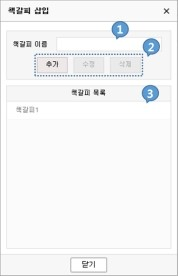
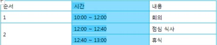
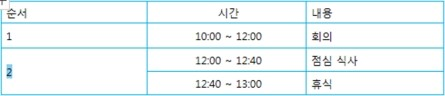
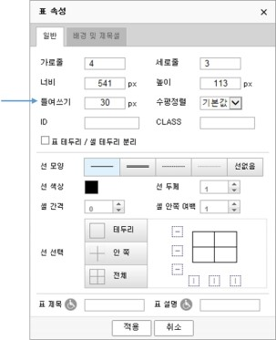

# KukuDocs Edition v1.0 사용자 매뉴얼
발행일: 2017년 11월

# 1. 문서 변경 이력

버전|작성일자|변경사항|작성자|변경사유  
:-:|:-:|:-:|:-:|:-:
1.0|2017-11-01|최초 작성|임수연|

문서가 변경되면 반드시 업데이트하여 버전을 관리하여 주시기 바랍니다.

  

# 2. KukuDocs Editor 툴 메뉴

#### ① Toolbar control  

HTML 의 WISYWIG 편집을 가능하게 해주는 기능을 가지고 있습니다. 아래에서 전체메뉴의 구성과 각 아이콘의 기능을 보실 수 있습니다.

#### ② 내용 편집 창

내용 편집 창은 Tab control 에 따라 Editor 편집 창, HTML 소스보기 창, TEXT 편집 창, 미리보기 창이 나타나는 곳으로 문서 생성 및 편집의 주 작업이 이루어지는 공간입니다.

#### ③ Tab control

편집한 HTML 문서가 Web Browser 에서 원하는 형태로 미리 볼 수 있는 기능을
제공합니다.

## 1) 파일 기능 설명

### 1-1) 새로 만들기 

1. 편집 중일 경우 작성 중인 내용의 제거 여부를 선택 후 새 문서가 열립니다.  

1. 편집 중인 내용이 없을 때는 바로 새 문서가 열립니다.

### 1-2) 파일 열기 

원하는 파일을 선택하여 불러올 수 있습니다.  
(지원 가능한 파일 확장자: html, htm, txt)  

### 1-3) 저장 

작업중인 내용을 특정 파일로 사용자의 컴퓨터에 저장합니다.

1. 저장 아이콘을 클릭하면 아래와 같이 저장 여부를 묻는 메시지가 화면 아래에
뜨게 됩니다.  

1.  원하는 저장 위치를 찾아서 저장합니다.  

### 1-4) 인쇄 

사용자의 컴퓨터에 설정되어 있는 프린터로 작업중인 내용을 인쇄합니다.

### 1-5) 자동 저장 불러오기 

1. 에디터에 자동저장되어 있던 내용을 불러옵니다
1. 자동저장 설정은 환경설정에서 할 수 있습니다.  

### 1-6) 레이아웃 

자유롭게 화면을 구성하고, 간편하게 문서의 레이아웃을 설정 수 있습니다.  

### 1-7) 템플릿 

업무에 필요한 템플릿을 목록에서 선택하여 쉽고 간편하게 용도에 맞는 문서를 작성할 수 있습니다.  

  

## 2) 편집 기능 설명

### 2-1) 되돌리기 

1. 편집 작업을 취소하거나 취소했던 작업을 원래대로 복원합니다.
1. 클릭할 때마다 가장 최근에 한 작업이 한 단계씩 취소됩니다.
1. 아무런 작업을 하지 않았거나 진행한 작업을 모두 돌이킨 후에는 되돌리기를 할 수 없습니다.  

### 2-2) 되살리기 

1. 취소했던 편집작업을 다시 원래대로 실행합니다.
1. 클릭할 때마다 가장 최근에 되돌리기 한 작업이 한 단계씩 복원됩니다.
1. 되살릴 작업이 더 이상 없다면 아무 일도 일어나지 않습니다

### 2-3) 복사 

1. 텍스트나 표, 그림등을 복제하여 옮깁니다.
1. 선택한 부분은 클립보드로 복사되고 문서에도 그대로 남아있습니다.
1. 복사한 부분은 클립보드에 보관되어 있으므로 다른 곳에 붙여 넣을 수
있습니다.
1. 클립보드에 새로운 내용을 복사하면 이전에 보관되어 있던 내용은 사라집니다. 

### 2-4) 붙여넣기 
 
1. 클립보드에 보관되어 있는 내용을 커서가 놓여있는 위치에 삽입합니다.
1. 붙여넣기를 하려면 먼저 복사나 잘라내기를 해야합니다.

### 2-5) 잘라내기 

1. 선택한 텍스트나 표, 그림등이 사라지면서 클립보드로 복사됩니다.
1. 잘라낸 부분은 클립보드에 보관되어 있으므로 다른 곳에 붙여 넣을 수 있습니다.

### 2-6) 텍스트로 붙여넣기 

1. 웹사이트에서 필요한 자료를 가져올 때 대부분 복사를 사용하는데, 텍스트의 서식과 링크까지 같이 복사됩니다.
1. 텍스트로 붙여넣기를 하면 텍스트만 유지되기 때문에 직접 입력할 필요 없이 웹사이트의 자료를 가져올 수 있습니다.

### 2-7) 전체 선택 

1. 커서의 위치에 상관없이 편집 중인 문서의 모든 내용이 선택됩니다. 
1. 블록으로 선택된 전체 내용을 복사, 잘라내기, 지우기, 붙여넣기 등의 편집
작업을 할 수 있습니다.

### 2-8) 페이지 분할 

인쇄할 때 분할한 페이지 대로 인쇄합니다.  

### 2-9) 찾기/바꾸기 

1. 찾기 입력 칸에 에디터에서 작업중인 문자를 넣고 찾기 버튼을 클릭합니다.
1. 찾은 단어를 바꾸고 싶은 문자로 변경할 때는 단어를 입력 후 바꾸기 버튼을 클릭합니다.
1. 모두 바꾸기 버튼을 클릭하면 에디터 전체에서 찾은 문자를 변경하고 싶은 문자로 바꿉니다.  

  

## 3) 보기 기능 설명

### 3-1) 전체화면 

에디터 화면을 전체/기본 화면으로 전환합니다.

1. 편집 화면  
: 에디터에서 편집 작업을 할 수 있는 화면입니다.
1. HTML 소스보기  
: 에디터에서 편집한 작업 내용을 HTML 로 보여줍니다.
1. 텍스트 영역 보기  
: 에디터에서 작업한 내용 중 텍스트만 보여줍니다.
1. 미리 보기  
: 에디터에서 작업한 내용을 브라우저에서 미리 보기 합니다.

  

## 4) 삽입 기능 설명

### 4-1) 하이퍼링크 

하이퍼링크를 생성하여 사용자가 웹페이지로 쉽게 이동할 수 있도록 도와줍니다.  

① 링크 종류를 URL 과 책갈피 중 선택합니다.  
② 상세 내역을 설정한 후 적용 버튼을 클릭하면 하이퍼링크가 생성됩니다.

### 4-2) 하이퍼링크 제거 
하이퍼링크를 제거하면 텍스트로 입력됩니다.

### 4-3) 책갈피 
에디터에 책갈피를 삽입합니다.  

① 새로 추가할 책갈피 이름을 작성합니다.  
② 추가 버튼을 클릭하면 책갈피가 추가됩니다.  
③ 목록에 추가되어 있는 책갈피들 중 하나를 선택하면, 2번의 수정, 삭제 버튼이 활성화되어 수정이나 삭제를 할 수 있습니다.  

### 4-4) 수평선 삽입 

에디터에 수평선을 삽입합니다.

### 4-5) 날짜/시간 삽입 

에디터에 원하는 형식의 날짜와 시간을 삽입할 수 있습니다.  

### 4-6) 문서 배경 이미지 

에디터 문서의 배경 이미지를 설정할 수 있습니다.  

① 이미지 찾기에서 배경에 넣을 이미지를 선택할 수 있습니다.  
② 붙임형태에서 스크롤의 위치를 설정할 수 있습니다.  
③ 반복형태에서 배경이미지의 반복여부 가로방향과 세로방향의 반복여부를 설정할 수 있습니다.  
④ 수평과 수직 위치를 설정할 수 있습니다.  
⑤ 배경 색상을 클릭하여 다양한 배경색을 설정할 수 있습니다.  
⑥ 배경 제거의 네모 박스를 체크(클릭)하면 설정했던 배경이미지와 색이 모두 제거됩니다.  

### 4-7) 이미지 

사용자 이미지(일반) 또는 외부 URL 링크 이미지(하이퍼링크)를 추가합니다.  

1. ①번 이미지 찾기 버튼을 클릭하여 삽입할 이미지를 선택할 수 있습니다.
1. 필요한 이미지의 속성값을 입력한 후 적용 버튼을 누르면 이미지가 삽입됩니다.
1. 이미지에 링크를 걸어줄 경우 ②번을 클릭하여 링크 종류를 선택하고, 기타 속성을 입력한 후 적용을 눌러줍니다.

### 4-8) 동영상 삽입 

외부 동영상을 삽입할 수 있습니다.  

1. ①번을 클릭하여 동영상 종류를 파일과 소스입력 중 선택하여 삽입할 수
있습니다.
1. ②번을 클릭하면 원하는 동영상 파일을 삽입할 수 있습니다.
1. 소스를	직접	입력하려면	동영상	종류에서	소스입력을	선택한	후	③번에
동영상의 소스코드를 붙여넣기 합니다.

### 4-9) 파일 삽입 
파일을 삽입할 수 있습니다.  

1. ①번을 클릭하여 삽입하고 싶은 파일을 찾아 추가합니다.
1. 필요 시 ②번 항목에 파일 제목을 입력합니다.
1. ③번 항목에 파일의 ID 와 Class 값을 추가하고 적용 버튼을 클릭하면 에디터에 삽입됩니다.

### 4-10) 특수기호 삽입 

에디터에 특수문자를 삽입합니다.  

1. 특수문자의 종류를 ①번 탭 박스에서 선택합니다.
1. 특수문자를 클릭하면 ②번 영역에 선택한 기호가 표시되고 적용 버튼을 누르면 에디터에 삽입됩니다.

### 4-11) 이모티콘 삽입 

에디터에 이모티콘을 삽입합니다.  

팝업창에서 원하는 이모티콘을 클릭하면 에디터에 삽입됩니다.

### 4-12) 대/소문자 변환 

에디터 내의 영문 대소문자를 변경합니다.  

1. 변경할 텍스트를 지정한 후 대/소문자 변환을 클릭합니다.
1. 변경할 옵션을 선택한 후 적용을 클릭하면 에디터에 변경 내용이 반영됩니다.

### 4-13) 인용 구문 

남의 말이나 글에서 직/간접으로 따온 문장을 ‘인용 구문’이라고 합니다. 문서에서 인용구문임을 나타내기 위한 형태를 박스에서 선택한 후 삽입할 글을 입력합니다.  

1. 인용 구문을 삽입 할 위치에 커서를 놓고 인용 구문 아이콘을 클릭합니다.
1. 원하는 인용 구문 형태를 선택 후 삽입할 글을 입력합니다.

- Tip. 문서에 작성한 내용 중에서 인용 구문을 표시할 경우, 문장을 선택한 후 인용 구문 아이콘을 클릭하면 선택한 부분이 인용 구문 형태로 변경됩니다.

### 4-14) 레이어 삽입 

레이어를 이용하여 문서에서 특정 위치에 텍스트를 입력하거나 이미지와 같은 개체를 삽입할 수 있습니다.  

1. 너비, 높이: 레이어의 너비와 높이를 픽셀 단위로 지정합니다.
1. 수평 위치, 수직 위치: 레이어의 위치 상태를 지정합니다.
1. 필요한 경우 ID 와 CLASS 의 내용을 기입합니다.

  

## 5) 서식 기능 설명

### 5-1) 기본 서식   

Heading 태그 (h1 ~h6)를 입력합니다.

### 5-2) 글꼴 

텍스트의 새로운 글꼴을 선택합니다.

### 5-3) 크기 

텍스트 크기를 변경합니다.

### 5-4) 굵게 

텍스트를 굵게 표시합니다.

### 5-5) 기울임 

텍스트를 기울임꼴로 표시합니다. 

### 5-6) 밑줄 

텍스트에 밑줄을 그어 표시해 줍니다.

### 5-7) 취소선 

가운데를 관통하는 선을 긋습니다.

### 5-8) 위 첨자 

텍스트 줄 아래에 작은 문자를 입력합니다.

### 5-9) 아래 첨자 

텍스트 줄 아래에 작은 문자를 입력합니다. 

### 5-10) 글자 서식 제거 

기본서식으로 되돌릴 텍스트를 선택한 후 글자 서식 제거를 클릭하면 모든 서식을 지워 텍스트를 기본 서식 스타일로 되돌립니다.

### 5-11) 글자색 

에디터에서 텍스트 색을 변경할 수 있습니다. 변경할 텍스트를 선택한 후 글자색을 클릭하여 원하는 색을 선택합니다.

### 5-12) 바탕색 

텍스트를 강조하고 싶을 때 원하는 색을 선택하여 텍스트의 바탕을 변경할 수 있습니다. 

### 5-13) 글자 서식 복사 

서식 복사를 사용하면 한 개체의 서식 전체를 복사하여 다른 개체에 적용할 수 있습니다. 서식을 복사할 텍스트나 그래칙을 선택한 후 글자 서식 복사를 클릭합니다. 

### 5-14) 글자 서식 붙여넣기 

동일한 서식을 원하는 곳에 붙여넣기 합니다. 

### 5-15) 글머리 번호 

번호를 매긴 목록을 만듭니다.

### 5-16) 글머리 기호 

글머리 기호 목록을 만듭니다.

### 5-17) 내어쓰기 

커서가 위치한 부분 또는 사용자가 선택한 부분의 문단을 40x 정도 왼쪽으로 이동시켜 줍니다. 

### 5-18) 들여쓰기 

커서가 위치한 부분 또는 사용자가 선택한 부분의 문단을 40x 정도 오른쪽으로 이동시켜 줍니다.

### 5-19) 줄간격 

텍스트 줄 또는 단락 사이의 간격을 지정해 줍니다.

### 5-20) 문단 여백  

문단 사이의 여백을 설정할 수 있습니다.  

1. 여백을 설정하줄 문단 안에 마우스 커서를 둔 뒤에 문단여백을 클릭하여 문단의 왼쪽과 오른쪽에 여백을 줄 수 있습니다.
1. 문단과 문단 사이의 여백은 상단 여백과 하단 여백의 숫자를 조정하여 설정할 수 있습니다.
1. 문단 안에서 글자 간격과 단어 간격 또한 문단여백에서 조절할 수 있습니다. (설정 값은 상하 화살표로 조정하거나, 숫자를 직접 입력할 수 있습니다.)

### 5-21) 수평정렬 

선택한 부분의 문단을 수평 정렬합니다. 왼쪽, 가운데, 오른쪽, 양쪽으로
정렬할 수 있습니다.

### 5-22) 문단 서식 제거 

기본서식으로 되돌릴 문단을 선택한 후 문단 서식 제거를 클릭하면 모든 서식을 지워 선택한 문단을 기본 서식 스타일로 되돌립니다.

  

## 6) 표 기능 설명

### 6-1) 표 생성 – 일반 

새로 표를 그립니다.  

① 표의 열 개수와 행 개수를 지정합니다.  
② 표의 가로와 세로 길이를 지정합니다. 단위는 pixel 입니다.  
③ 표를 오른쪽으로 이동시켜 줍니다.  
④ 표의 정렬 형식을 지정합니다.  
⑤ 표의 ID 와 CLASS 를 지정합니다.  
⑥ 셀과 셀의 경계 부분 또는 셀과 표의 테투리의 경계 부분을 분리합니다.  
⑦ 표의 테두리 선의 모양을 지정합니다.  
⑧ 표나 셀의 선 색상을 지정합니다.  
⑨ 표나 셀의 선 두께를 지정합니다.  
⑩ 셀의 안쪽과 바깥 경계선 사이의 간격을 지정합니다.  
⑪ 셀의 안쪽 여백을 지정합니다.  
⑫ 원하는 셀의 모양, 종류, 두께, 색상을 사용자의 필요에 맞춰 표에 적용합니다.  
⑬ 표의 제목과 설명을 설정합니다.  

아래 화살표를 클릭하면 바로 열과 행을 지정하여 표를 그릴 수 있습니다.  

### 6-2) 선 스타일

위의 표 생성 내용 중 ⑦, ⑧, ⑨, ⑫ 번 항목을 선 스타일을 클릭하여 설정할 수 있습니다.

### 6-3) 표 생성 – 배경 및 제목 셀

표의 배경 및 제목 셀을 설정합니다.  

① 표의 배경 이미지를 설정합니다.  
② 표의 배경이미지의 붙임 형태를 지정합니다.  
③ 표의 배경이미지가 표보다 작을 경우 반복 여부와 형태를 지정합니다.  
④ 표에서 배경이미지의 수평과 수직 위치를 지정합니다.  
⑤ 표의 배경 색상을 선택합니다. 배경 이미지를 지정한 경우, 배경 이미지가 색보다 우선순위로 나옵니다.  
⑥ 표에서 제목 셀의 Scope(row 또는 col) 설정 여부를 결정합니다.  

### 6-4) 표 바탕색 

표에서 원하는 셀을 선택하여 바탕색을 지정할 수 있습니다.

### 6-5) 상단 행 삽입 

현재 커서가 위치한 셀의 아래쪽에 새로운 행을 삽입합니다. 

### 6-6) 하단 행 삽입 

현재 커서가 위치한 셀의 위쪽에 새로운 행을 삽입합니다. 

### 6-7) 왼쪽 열 삽입 

현재 커서가 위치한 셀의 왼쪽에 새로운 열을 삽입합니다. 

### 6-8) 오른쪽 열 삽입  

현재 커서가 위치한 셀의 오른쪽에 새로운 열을 삽입합니다.

### 6-9) 열 삭제 

현재 커서가 위치한 열을 삭제합니다.

### 6-10) 행 삭제 

현재 커서가 위치한 행을 삭제합니다.

### 6-11) 테이블 삭제 

테이블을 통째로 삭제합니다.

1. 표 앞에 커서를 놓고 delete 키를 누르면 표가 통째로 제거됩니다.
1. 표 뒤에 커서를 놓고 backspace 키를 누르면 표가 통째로 제거됩니다.

### 6-12) 병합 

두 개 이상의 선택된 셀을 하나로 합칩니다.

### 6-13) 열 분할 

현재 커서가 위치한 셀을 두개의 열로 분할합니다.

### 6-14) 행 분할 

현재 커서가 위치한 셀을 두개의 행으로 분할합니다.

  

## 7) 도구 기능 설명

### 7-1) 환경 설정 

HTML 의 기본 사항을 설정할 수 있습니다.  

자동저장 사용을 분 단위로 설정할 수 있습니다.

### 7-2) 도움말 

쿠쿠닥스 에디터의 사용자 매뉴얼을 보고 사용하실 수 있습니다.

### 7-3) 버전 정보 

Kukudocs Editor 1.0 (2017. 11. 11)

  

# 3. Kukudocs Editor 기능 익히기

쿠쿠닥스 에디터의 다양한 기능을 소개합니다. 직관적인 인터페이스로 처음 입문하는 사용자도 편리하게 문서를 작성할 수 있습니다. 목록에서 원하는 항목으로 이동하면 문서를 작성하는 기본적인 사용 방법부터 각 기능의 세부 사항을 익히고 활용할 수 있도록 안내합니다.

## 1) 기본적인 사용 방법

쿠쿠닥스	에디터는	다양한	플랫폼과	멀티	브라우징을	지원하며,	웹	표준에	따라 사용자의 응용 프로그램에서 최대한 간단하고 신속하게 작동합니다. 또한, 매우 가벼우며 사용자에게 풍부한 텍스트로 자신을 표현할 수 있는 효과적인 수단을 제공하는 동시에 최소한의 영향으로 모든	사이트에 쉽게 통합	될 수 있어 메일이나 그룹웨어 등 업무에서뿐만 아니라 홈페이지, 블로그 게시판 등 사용자의 필요에 따라 다양한 방식으로 사용할 수 있습니다.

여기에서는 문서를 작성하는데 기본이 되는 글, 그림, 표, 하이퍼링크 삽입 등 쿠쿠닥스 에디터를 사용하는 기본적인 방법에 대해 안내합니다.

### 1-1) 내용 입력 (내용 입력과 글꼴 속성 변경하기)

1. 편집 창에 작성하려는 문서의 내용을 입력합니다. 글을 입력하는 도중 Enter 키를 누르면 커서가 다음 문단으로 내려가고 한번 더 누르면 앞 문단과의 사이에 한 줄 정도의 공간이 생깁니다.
1. 변경하고 싶은 문단의 일부를 블록으로 지정하여 글꼴의 종류와 크기, 색깔을 바꿀 수 있습니다. 글꼴에서 원하는 글꼴을 지정하고, 크기에서 텍스트 크기를 변경하고, 글자색에서 원하는 텍스트 색깔을 지정할 수 있습니다.  

1. 서식 도구 아이콘을 이용하여 다양한 속성(굵게, 기울임, 밑줄, 정렬 방식, 줄 간격, 글머리 기호, 글머리 번호, 들여쓰기 등)을 지정할 수 있습니다.

### 1-2) 글자 속성 설정하기
① 글꼴이나 크기, 모양, 색 등과 같은 글자의 속성을 설정할 수 있습니다.  
② 바꾸고 싶은 텍스트의 글자 속성은 서식 도구 아이콘을 사용하여 변경할 수 있습니다.  

1. 편집창에서 변경하고 싶은 텍스트를 선택합니다.  
1. 글꼴을 바꾸려면 ②번 화살표를 클릭하여 원하는 글꼴을 선택합니다.  
1. 글자 크기를 바꾸려면 ③번 화살표를 클릭하여 원하는 크기를 선택합니다.  
1. 글자 모양이나 색 등 다양한 효과를 삽입하고 싶다면, ④번 도구 아이콘에서 해당 아이콘을 선택하여 설정할 수 있습니다.  

### 1-3) 이미지 넣기

사용자 이미지(일반) 또는 외부 URL 링크 이미지(하이퍼링크)를 문서에 삽입할 수 있습니다.  

1. 그림을 삽입할 위치에 커서를 놓고 도구 아이콘에서 이미지 아이콘을 클릭합니다. 
1. 이미지 삽입 대화상자가 나타나면 ①번 이미지 찾기 버튼을 클릭하여 삽입할 이미지를 선택합니다.
1. 필요한 이미지의 속성값(이미지 제목과 설명)을 입력한 후 적용 버튼을 누르면 이미지가 삽입됩니다.
1. 이미지에 링크를 걸어줄 경우 ②번을 클릭하여 링크 종류를 선택하고, 기타 속성을 입력한 후 적용을 눌러줍니다. 

### 1-4) 이모티콘 넣기 

작성중인 문서에 다양한 이모티콘을 넣을 수 있습니다.  

1. 도구 아이콘에서 이모티콘 삽입을 누르면 대화상자가 나타납니다.
1. 원하는 이모티콘을 선택하면 커서가 놓인 위치에 이모티콘이 삽입됩니다.

### 1-5) 하이퍼링크 만들기

① 하이퍼링크(hyperlink)란 현재의 문서에서 다른 문서로 이동할 수 있게 해주는 연결고리를 뜻합니다.  
② 하이퍼링크를 지정하면 사용자가 다른 문서나 웹 페이지, 책갈피 등으로 쉽게
이동할 수 있습니다.  

1. 하이퍼링크를 지정할 텍스트를 선택합니다. 하이퍼링크를 지정할 부분이 그림이라면 해당 그림을 선택합니다.
1. 도구 아이콘에서 하이퍼링크 아이콘을 클릭합니다.
1. 하이퍼링크 대화상자가 뜨면 ①번을 눌러 링크 종류 선택합니다.
1. ②번 주소 입력 상자에 연결할 주소를 입력하고 상세 내역을 추가한 후 적용 버튼을 클릭하면 하이퍼링크가 생성됩니다.

### 1-6) 찾기와 바꾸기

문서를 작성하다 보면 문서 내에서 내용을 찾고 바꾸는 일이 발생합니다. 찾기/바꾸기 대화상자를 이용하면 특정 텍스트를 찾아 바꾸는 작업을 손쉽게 할 수 있습니다.  

1. 도구 아이콘에서 찾기/바꾸기 아이콘을 클릭합니다.
1. 찾기/바꾸기 대화상자가 나타나면 찾기 입력칸에 찾고 싶은 텍스트를 입력합니다.
1. 찾기 버튼을 클릭하면 에디터 안에서 찾을 내용과 일치하는 부분이 블록으로 지정되어 나타납니다.
1. 찾은 단어를 바꾸고 싶을 때는 바꾸기 입력칸에 원하는 텍스트를 입력 후 바꾸기 버튼을 클릭합니다.
1. 모두 바꾸기 버튼을 클릭하면 에디터 전체에서 찾은 문자를 바꾸고 싶은 문자로 모두 바꿔줍니다.

### 1-7) 문단 삽입 기능

1. 표를 삽입한 경우 상, 하단에 문단이 없으면 텍스트를 입력할 수 없습니다.
1. 표의 상, 하단에 커서를 놓으면 문단을 삽입할 수 있는 표시가 나타나며 Paragragh Insert 탭을 클릭하면 문단이 삽입됩니다.  

  

## 2) 표 만들기

대부분의 데이터는 목록 형태를 띠고 있기 때문에 표는 데이터를 처리할 수 있는 뛰어난 도구입니다. 표를 이용하면 얻은 지식을 간략하고 질서 있게 표시할 수 있고 데이터의 관찰, 비교, 해석을 아주 간단하게 할 수 있습니다.

표는 하나 이상의 행과 열로 구성되고 각 행과 열은 하나 이상의 셀로 구성됩니다. 쿠쿠닥스 에디터는 행과 열, 셀을 조작해 표를 만들 수 있으며 텍스트와 그래픽의 레이아웃을 지정할 수 있습니다.

여기에서는 표를 만들고 사용하는 방법에 대해서 안내합니다. 

### 2-1) 표 삽입하기

#### 2-1-1) 도구 아이콘을 이용해서 표 그리기

1. 도구 아이콘에서 표 생성 아이콘을 클릭합니다.
1. 새 표 대화상자가 나타나면 가로줄과 세로줄에 원하는 표의 행과 열 수를 입력합니다.
1. 적용 버튼을 입력하면 에디터의 편집 창에 다음과 같은 표가 삽입됩니다.  

1. 입력하려는 셀에 마우스 커서를 옮긴 뒤 내용을 입력할 수 있습니다.

#### 2-1-2) 드래그하여 표 그리기

표를 삽입한 후에는 표 속성에서 선 색이나 두께, 배경 등을 원하는 스타일로 지정할 수 있습니다.

### 2-2) 표 삽입하기
삽입한 표의 테두리 색을 수정할 수 있습니다.

1. 테두리 색을 수정할 표 안에 커서를 둔 채로 마우스 오른쪽 버튼을 누릅니다.
1. 바로가기 메뉴에서 표 속성을 선택합니다.
1. 표 속성 대화상자가 열리면 선 색상 옆의 색깔 버튼을 눌러 원하는 색을 선택합니다.
1. 선 선택에서 변경하고 싶은 테두리(안쪽, 전체)를 선택한 후 적용 버튼을 누릅니다.

### 2-3) 표 크기 바꾸기

#### 2-3-1) 표 속성 대화상자에서 변경하기

1. 표 속성 대화상자에서 너비와 높이에 값을 입력하여 표의 크기를 바꿀 수 있습니다. 단위는 픽셀입니다. 
1. 픽셀 단위 크기의 정밀한 표가 필요한 경우가 아니라면 마우스로 드래그하여 표 크기를 조절할 수 있습니다. 

#### 2-3-2) 드래그하여 변경하기

1. 표의 경계선에 마우스 포인터를 올려놓으면 양쪽 화살표 모양이 나타납니다.  

1. 나타난 화살표를 누른 채 이동하면 해당 경계선이 움직여 셀의 크기를 조절할
수 있습니다.  

### 2-4) 셀 합치기
1. 표의 일부 셀을 합치려면, 합치려는 셀을 블록으로 지정해야 합니다.  

1. 도구 아이콘에서 병합을 클릭하면 각 셀의 내용이 한 셀 안에 표시됩니다.  

### 2-5) 셀 내용 정렬하기
1. 정렬할 셀을 블록으로 지정합니다.  

1. 도구 아이콘에서 가운데 정렬을 누르면 선택한 셀들이 수평 정렬에서
가운데로 정렬되어 나타납니다.  

### 2-6) 셀 나누기
1. 나누고 싶은 셀을 선택하거나 커서를 놓고 도구 아이콘에서 열 분할이나 행
분할을 클릭합니다.  

1. 선택한 셀의 열을 나누고 싶을 때는 열 분할 아이콘을, 행을 나누고 싶을
때는 행 분할 아이콘을 클릭합니다.  

### 2-7) 행 삽입하기
1. 행을 삽입하려는 위치에 커서를 놓은 뒤 도구 아이콘에서 상단 행 삽입이나
하단 행 삽입을 클릭합니다.  

1. 행을 위, 아래로 삽입할 수 있으며 원하는 곳으로 해당 아이콘을 누르면
지정한 대로 행이 삽입됩니다.  

### 2-8) 표 들여쓰기

커서가 놓여 있는 표에 대하여 들여쓰기를 적용합니다. 들여쓰는 정도는 pixel 단위로 사용자가 변경할 수 있습니다.  

1. 들여쓰기를 적용할 표 안에 커서를 놓고 마우스 오른쪽 버튼을 클릭하여 표 속성을 선택합니다.
1. 들여쓰기 입력칸에 원하는 숫자를 입력 후 적용을 클릭하면 표 들여쓰기가 적용됩니다.

### 2-9) 표 테두리 고치기

표의 테두리 두께와 색깔을 변경하면 표를 더욱 다양하게 꾸밀 수 있습니다. 표의 테두리를 변경하는 방법은 다음과 같습니다.

1. 표 안에 커서를 둔 상태에서 마우스 오른쪽 버튼을 클릭한 후 표 속성을 선택합니다.
1. 표 대화상자에서 선 색상(①)과 선 두께(②)를 지정한 후 선 선택에서 전체(③)를 클릭하면 선택한 내용이 반영되어 미리보기(④)로 보여집니다.
1. 적용 버튼을 클릭하면 설정한 내용이 표에 반영됩니다.

### 2-10) 표 복사 & 붙여 넣기

표 전체나 부분을 블록으로 지정한 후 복사 & 붙여 넣기가 가능합니다.

1. 표 전체를 복사하는 경우  

1. 표 일부를 복사하는 경우  

  

# 3. 이미지

웹페이지에서 문서를 만들 때 내용도 중요하지만, 눈에 보이는 화면의 디자인 등도 중요합니다.	내용과 어울리는 이미지나 클립아트 등을 삽입하게 되면 보다 확실하게 내용 전달을 할 수 있습니다. 쿠쿠닥스 에디터는 JPG 나 BMP, PNG, GIF 등의 이미지 형식을 지원하며, 쉽게 이미지를 삽입하고 편집할 수 있습니다.

여기에서는 문서에 이미지를 삽입하는 방법과 수정 및 변경 등에 관한 설정 내용에 대하여 안내합니다.

### 3-1) 이미지 삽입

하드디스크에 저장해 놓은 사진이나 그림, 인터넷에서 다운로드 받은 이미지
등을 문서에 삽입할 수 있습니다.  

1. 그림을 삽입 할 위치에 커서를 놓고 도구 아이콘에서 이미지를 클릭합니다. 
1. 이미지 삽입 대화상자가 나타나면 이미지 찾기를 클릭하여 문서에 삽입 할 그림을 선택합니다.
1. 필요할 경우 제목이나 설명을 입력하고, 적용 버튼을 누르면 다음과 같이 문서에 삽입됩니다.

### 3-2) 배경 이미지 삽입

1. 도구 아이콘에서 배경이미지를 클릭합니다.
1. 배경이미지 설정 대화상자가 나타나면 이미지 찾기를 클릭하여 배경으로 사용할 이미지를 선택합니다.
1. 배경이미지의 붙임 형태를 지정합니다.
   - 고정: 배경 이미지가 화면에 고정되어 보이게 할 때 선택합니다.
   - 스크롤: 배경 그림이 스크롤과 함께 움직이게 할 때 선택합니다.
1. 배경 이미지의 반복 형태를 지정합니다.
   - 반복하지 않음: 배경 이미지를 반복 배열하지 않고 배경 이미지를 삽입할 때 선택합니다.
   - 반복: 배경 이미지를 반복하여 배열되도록 할 때 선택합니다.
   - 가로 방향으로 반복: 배경 그림이 가로로 반복 배열하며 배경을 채우도록 할 때 선택합니다.
   - 세로 방향으로 반복: 배경 그림이 세로로 반복 배열하여 배경을 채우도록 할 때 선택합니다.
1. 배경 그림의 수평 위치와 수직 위치, 배경 색 등을 지정합니다.
1. 설정을 마치고 적용 버튼을 클릭하면 선택한 이미지가 배경으로 나타납니다.

  

# 4. Kukudocs Editor 제품 정보

쿠쿠닥스 에디터는 웹 표준인 HTML5 기반의 Non-ActiveX 에디터로 크로스 브라우징과
멀티플랫폼을 지원합니다. 

제품안내|
---|
**제품이름**: 쿠쿠닥스 에디터 (Kukudocs Editor)   **제품버전**: 1.0|

  

# 5. 고객 지원
제품 구매 후 1 년동안 온라인 무상 지원서비스를 받을 수 있습니다.
* 방문 점검 요청 시 기술 지원 비용이 발생할 수 있습니다.

  

# 6. 기타 문의 사항
Kukudocs Editor 에 대해 궁금한 점은 ㈜쿠쿠닥스로 문의하시기 바랍니다.

고객지원 담당자 이메일: team@kukudocs.com  
전화번호: 02-6203-5757  
주소: 서울 성동구 연무장5가길 7, 현대테라스타워 E동 909호